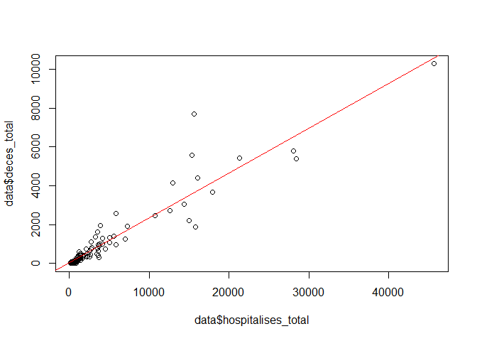
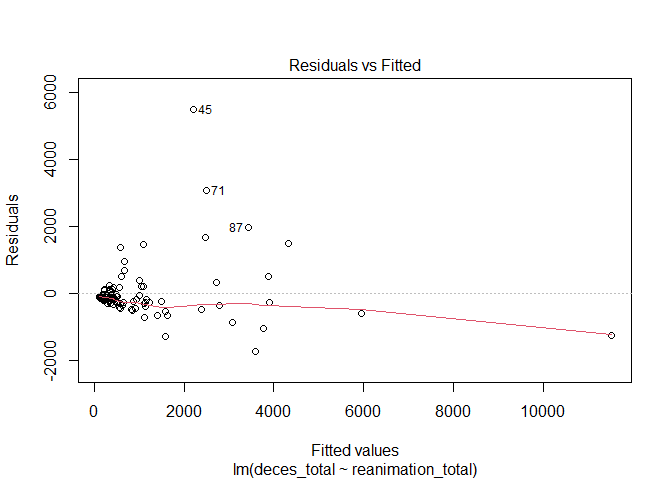
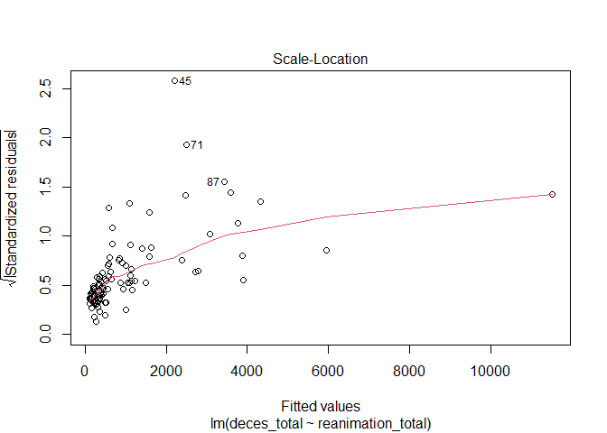
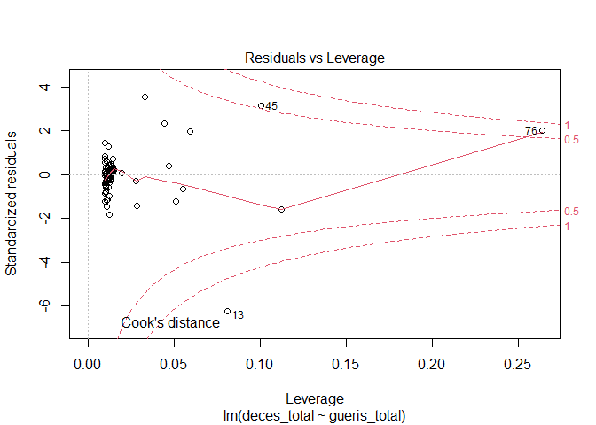
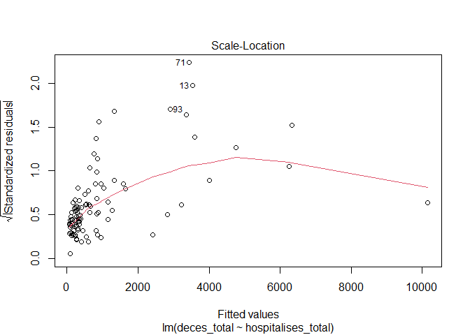
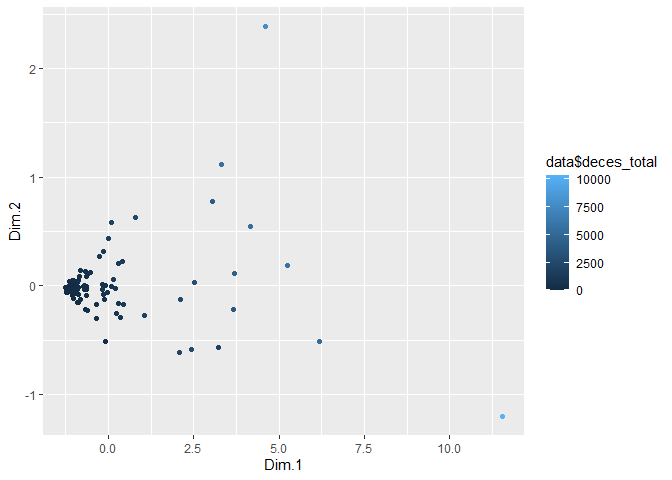
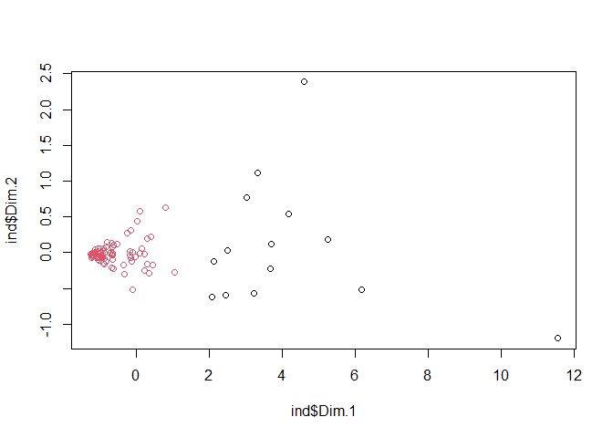
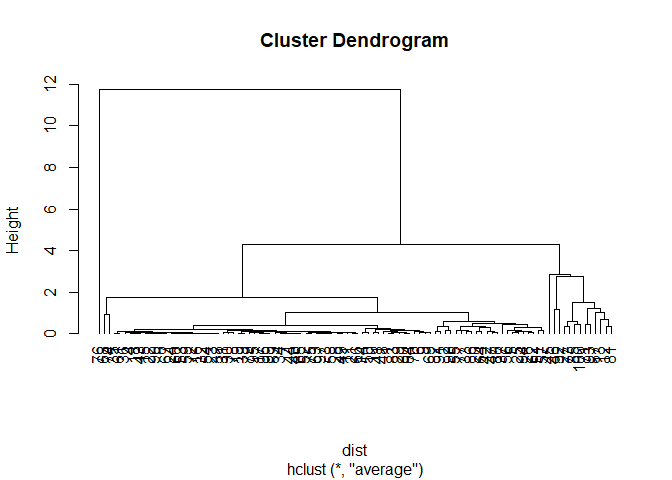

Ce projet a pour but de mettre en pratique une approche initiale des différentes analyses
supervisées et non supervisées abordées en cours, au moyen du logiciel et langage de
programmation statistique R. Nous nous intéressons à une problématique d’actualité, à savoir
l’épidémie du virus COVID-19. L’objectif de ce projet est d’analyser les données disponibles sur cette
pandémie afin d’essayer de comprendre l’évolution ainsi que la dynamique de propagation du viru

## Partie1: Analyses descriptives

Nous souhaitons effectuer une analyse descriptive des données disponibles à propos du COVID-19
par département en France. Les données considérées proviennent de la base de données
“Chiffres-clés” disponible sur le site “data.gouv.fr” auxquelles nous avons ajouté des informations
sur la localisation géographique des départements. La période étudiée dans ce projet est celle du 1er
Avril 2020 au 14 Avril 2020.

1. Charger le jeu de donnée sous R


```r
data=read.csv2("donnes_covid19_avril_total_par_departement_GPS.csv")
#View(data)
data
```

```
##                  maille_nom duree_jours   latitude    longitude deces_total
## 1                       Ain          15  46.247571    5.1307681         431
## 2                     Aisne          15  49.476920    3.4417368        1641
## 3                    Allier          15  46.311555    3.4167655         138
## 4   Alpes-de-Haute-Provence          15  44.077872    6.2375947          55
## 5           Alpes-Maritimes          15  43.946679    7.1790260         766
## 6                  Ardèche          15  44.759629    4.5624426         472
## 7                  Ardennes          15  49.762464    4.6285053         118
## 8                   Ariège          16  42.932629    1.4434690          13
## 9                      Aube          15  48.156342    4.3732462         618
## 10                     Aude          16  42.956905    2.2593428         478
## 11                  Aveyron          16  44.217975    2.6189273         200
## 12                 Bas-Rhin          15  48.634317    7.5252938        4416
## 13        Bouches-du-Rhône          15  43.591168    5.3102505        1877
## 14                 Calvados          15  49.121331   -0.4330578         350
## 15                   Cantal          15  45.119200    2.6326062           0
## 16                 Charente          15  45.751996    0.1534761          87
## 17        Charente-Maritime          15  45.749490   -0.7733188         255
## 18                 Corrèze          15  45.432008    2.0195909         141
## 19             Corse-du-Sud          15  41.810263    8.9245343         414
## 20               Côte-d'Or          15  47.512679    4.6354120        1283
## 21           Côtes-d'Armor          15  48.510810   -3.3263676         198
## 22                   Creuse          15  46.037763    2.0627832          36
## 23             Deux-Sèvres          15  46.592654   -0.3962844         113
## 24                 Dordogne          15  45.146949    0.7572205          17
## 25                    Doubs          15  47.196982    6.3126004         826
## 26                   Drôme          15  44.731190    5.2266675         948
## 27                  Essonne          15  48.458570    2.1569416        2208
## 28                     Eure          15  49.118176    0.9582114         333
## 29             Eure-et-Loir          15  48.552524    1.1989814         466
## 30               Finistère          15  48.252025   -3.9300525         158
## 31                     Gard          16  38.862269  -89.9601020         284
## 32                     Gers          16  43.636648    0.4502368         104
## 33                  Gironde          15  44.849665   -0.4502368         763
## 34               Guadeloupe          15  16.265000  -61.5510000         129
## 35                   Guyane          15   3.933889  -53.1257820           0
## 36              Haute-Corse          15  42.409788    9.2785583          39
## 37            Haute-Garonne          16  43.401046    1.1353020         300
## 38              Haute-Loire          15  45.082123    3.9266366          60
## 39              Haute-Marne          15  48.126097    5.1071322         429
## 40             Hautes-Alpes          15  44.600872    6.3226072          27
## 41             Haute-Saône          15  47.756981    6.1556282         593
## 42             Haute-Savoie          15  46.175679    6.5389621         985
## 43        Hautes-Pyrénées          16  43.019392    0.1494988          94
## 44             Haute-Vienne          15  45.743517    1.4025484         137
## 45                Haut-Rhin          15  47.931504    7.2441099        7703
## 46           Hauts-de-Seine          15  48.828508    2.2188068        5384
## 47                 Hérault          16  43.591236    3.2583626         888
## 48          Ille-et-Vilaine          15  48.229202   -1.5300695         376
## 49                    Indre          15  39.985680  -75.3136130         360
## 50           Indre-et-Loire          15  47.289493    0.8160970         346
## 51                   Isère          15  44.995775    5.9293476         476
## 52                     Jura          15  41.055068  -74.0616663         260
## 53                   Landes          15  43.941204   -0.7532809          78
## 54              La Réunion          15 -21.115141   55.5363840           0
## 55                    Loire          15  47.264898    0.3033295        1266
## 56         Loire-Atlantique          20  47.278047   -1.8157647        1000
## 57                   Loiret          15  47.900771    2.2018172         417
## 58             Loir-et-Cher          15  47.676190    1.4159072         218
## 59                      Lot          16  37.035363  -95.6015299          14
## 60           Lot-et-Garonne          15  44.247017    0.4502368          51
## 61                  Lozère          16  44.494203    3.5812692           0
## 62           Maine-et-Loire          20  47.291354   -0.4877852         756
## 63                   Manche          15  49.114712   -1.3115949         241
## 64                    Marne          15  48.708322    4.5677117        1415
## 65               Martinique          15  14.641528  -61.0241740          63
## 66                  Mayenne          20  48.306124   -0.6209350         248
## 67                  Mayotte          19 -12.827500   45.1662440          37
## 68       Meurthe-et-Moselle          15  48.799701    6.0947014        1917
## 69                    Meuse          15  49.082432    5.2823997         526
## 70                 Morbihan          15  47.885293   -2.9001865         729
## 71                  Moselle          15  49.098384    6.5527641        5577
## 72                  Nièvre          15  47.238171    3.5294522          92
## 73                     Nord          15  43.190526  -89.4379210        2712
## 74                     Oise          15  49.421457    2.4146396        2566
## 75                     Orne          15  48.638857    0.0848201         171
## 76                    Paris          15  48.856614    2.3522219       10285
## 77            Pas-de-Calais          15  50.573277    2.3244679         975
## 78             Puy-de-Dôme          15  45.712414    3.0155825         154
## 79   Pyrénées-Atlantiques          15  43.326994   -0.7532809         219
## 80    Pyrénées-Orientales          16  42.601291    2.5396030         291
## 81                   Rhône          15  45.640290    5.6864994        3657
## 82          Saône-et-Loire          15  46.582751    4.4866710        1099
## 83                   Sarthe          20  47.921701    0.1655803         402
## 84                   Savoie          15  45.493204    6.4724000         268
## 85           Seine-et-Marne          15  48.841082    2.9993660        2453
## 86           Seine-Maritime          15  49.605419    0.9748439        1064
## 87        Seine-Saint-Denis          15  48.913745    2.4845729        5421
## 88                    Somme          15  49.914518    2.2707095        1339
## 89                     Tarn          16  39.419668 -106.1202374          96
## 90          Tarn-et-Garonne          16  44.012668    1.2891036          39
## 91    Territoire de Belfort          15  47.594657    6.9207716        1375
## 92             Val-de-Marne          15  48.793143    2.4740337        5804
## 93               Val-d'Oise          15  49.061590    2.1581351        4149
## 94                      Var          15  32.820195  -96.6326210         633
## 95                 Vaucluse          15  44.056505    5.1432068         249
## 96                  Vendée          20  46.661397   -1.4482662         292
## 97                   Vienne          15  45.525587    4.8743390         261
## 98                   Vosges          15  48.144643    6.3355935        1962
## 99                    Yonne          15  47.865273    3.6079823         256
## 100                Yvelines          15  48.785094    1.8256572        3054
##     reanimation_total hospitalises_total gueris_total
## 1                 446               1691         1457
## 2                 602               3563         3204
## 3                 266                745          959
## 4                  68                452          783
## 5                1088               3484         2939
## 6                 282               1473         2249
## 7                 254               1061          544
## 8                  70                259          174
## 9                 340               2536         1371
## 10                263               1308         1134
## 11                137                850          644
## 12               3989              16072        10818
## 13               3681              15822        13834
## 14                764               2147          917
## 15                111                367           89
## 16                 89                216          372
## 17                350               1182          677
## 18                139                651          350
## 19                287               1149          735
## 20               1004               4180         4981
## 21                187                979          576
## 22                130                306           79
## 23                120                487          284
## 24                 83                344          303
## 25               1078               2838         2937
## 26                950               3583         2264
## 27               3129              14985         5659
## 28                143               1042          496
## 29                422               2662         1542
## 30                511               1394          965
## 31                554               1399          946
## 32                 70                424          192
## 33               1368               4530         4941
## 34                254                547          605
## 35                 12                129          128
## 36                 24                153          999
## 37               1563               3711         2873
## 38                 90                367          503
## 39                245               1406          808
## 40                218                824          785
## 41                248               1237         1198
## 42               1196               4157         4475
## 43                 99                901          476
## 44                261               1023          507
## 45               2216              15648        15248
## 46               6170              28411        16028
## 47               1090               3686         4323
## 48                570               2268         1544
## 49                138                997          214
## 50                790               2561         1107
## 51                863               3388         2339
## 52                187               1337          709
## 53                166                340          315
## 54                 51                620          715
## 55               1475               6964         3342
## 56               1128               3790         2907
## 57               1066               3630         1943
## 58                213               1226          634
## 59                107                259          502
## 60                 98                438          207
## 61                 19                113          152
## 62                882               2691         3489
## 63                319               1001          566
## 64                957               5611         4739
## 65                268                745          602
## 66                226               1029          425
## 67                 52                269          278
## 68               2415               7238         4292
## 69                317               2315         2088
## 70                477               2053         2113
## 71               2523              15376         9153
## 72                137                539          130
## 73               3853              12565         7016
## 74               1044               5876         4868
## 75                181                966         1041
## 76              12013              45669        23513
## 77               1613               5792         3655
## 78                493               1118          834
## 79                409               1269         1106
## 80                506               1542         2306
## 81               4011              17894        11219
## 82                524               2683         2904
## 83                412               1831         1676
## 84                444               1694         2170
## 85               2839              10761         8532
## 86               1563               5012         2954
## 87               3508              21287        10549
## 88               1062               5048         2865
## 89                340                825          511
## 90                131                250          116
## 91                609               3239         2715
## 92               4439              28084        12035
## 93               2510              12911        11645
## 94                808               3608         4071
## 95                310               1173         1273
## 96                359               1036          839
## 97                365                846          621
## 98                522               3908         3142
## 99                288               1375          748
## 100              2762              14353         8433
```

2. Présentation du jeu de donnée, puis analyse descriptive


```r
summary(data)
```

```
##   maille_nom         duree_jours       latitude        longitude         
##  Length:100         Min.   :15.00   Min.   :-21.12   Min.   :-106.12024  
##  Class :character   1st Qu.:15.00   1st Qu.: 44.00   1st Qu.:  -0.03546  
##  Mode  :character   Median :15.00   Median : 46.28   Median :   2.26503  
##                     Mean   :15.42   Mean   : 43.78   Mean   :  -4.61076  
##                     3rd Qu.:15.00   3rd Qu.: 48.34   3rd Qu.:   4.93254  
##                     Max.   :20.00   Max.   : 50.57   Max.   :  55.53638  
##   deces_total    reanimation_total hospitalises_total  gueris_total    
##  Min.   :    0   Min.   :   12.0   Min.   :  113.0    Min.   :   79.0  
##  1st Qu.:  135   1st Qu.:  185.5   1st Qu.:  840.8    1st Qu.:  573.5  
##  Median :  355   Median :  410.5   Median : 1439.5    Median : 1166.0  
##  Mean   : 1047   Mean   : 1000.2   Mean   : 4357.9    Mean   : 2962.3  
##  3rd Qu.: 1016   3rd Qu.: 1069.0   3rd Qu.: 3819.5    3rd Qu.: 3238.5  
##  Max.   :10285   Max.   :12013.0   Max.   :45669.0    Max.   :23513.0
```

```r
dim(data)
```

```
## [1] 100   8
```

```r
select=c(2,5:8)
min=apply(data[select],2,min)
max=apply(data[select],2,max)
var=max-min
var
```

```
##        duree_jours        deces_total  reanimation_total hospitalises_total 
##                  5              10285              12001              45556 
##       gueris_total 
##              23434
```

```r
apply(data[select],2,sd)
```

```
##        duree_jours        deces_total  reanimation_total hospitalises_total 
##           1.173616        1742.547524        1611.107053        7092.236996 
##       gueris_total 
##        4102.062105
```

```r
apply(data[select],2,mean)
```

```
##        duree_jours        deces_total  reanimation_total hospitalises_total 
##              15.42            1046.84            1000.23            4357.94 
##       gueris_total 
##            2962.33
```
\
le jeu de donnée a une dimension 100 ligne et 8 colonnes\
le jeu de donnée nous donnes le nombre de:\
deces total (int)\
reanimation total (int)\
hospitalisation total (int)\
gueris total (int)\
en fonction des noms (string) des 100 departements francais.\
Chaque departement possede une localisation GPS indiqué par la longitude et l'altitude.\
On remarqu'il y a 3 départements qui possèdent 0 deces.\
Ces nombres sont prévelés selon une duree_jours qui indique en nombre de jour (int).\
La variables duree_jour est la moins étendu, seulement de 5 (entre 15 et 20) avec un ecart type de 1.1 et moyenne de 15.42.
Alors que la variable hospitalises_total est la plus étendu de 46k avec un ecart type de 7k1 et une moyenne de 4k3.\
Il y a des valeurs extrêmes pour deces_total reanimation_total hostpitalises_total et gueris_totral, car la moyenne est toujours au moins 2 fois plus élevé que la medianne\
\
\
On représente te les données quantitifs (cumulé) générals à tous les départements, en excluent la durée et les coordonnées gps.

```r
gen=c(sum(data$deces_total), sum(data$reanimation_total), sum(data$hospitalises_total), sum(data$gueris_total))
label=c('deces','reanimation','hospitalise','gueris')
color=c('red','orange','yellow','green')
pourcent<- round(100*gen/sum(gen), 1)
pie(gen, labels=paste(pourcent,"%",sep=""), main = "Covid19",col=color)
legend("topright", label, cex = 0.8,
   fill=color)
```

<!-- -->
\
Il y a autant de décès que de réanimation.\
Il y a 3 fois plus de guéris que de décès.\
Il y a plus d'hospitalisé que de guéris.\
\
On va maintenant essayer de comparer les departements entre eux\
On trie les données a affiché, et on fais un bloxplot sur les 20 premiers département pour avoir un echantillon

```r
df <- data.frame(t(data[c(5:length(data))]))
colnames(df) <- data[,1]
df=df[c(1:20)]
barplot(height=as.matrix(df), main="covid19", ylab="quantite de pers",beside=FALSE,col=color,las=2)
```

<!-- -->

```r
barplot(height=as.matrix(df), main="covid19", ylab="quantite de pers",beside=TRUE,col=color,las=2)
legend("topright", c("deces","reanimation","hospitalise","gueris"), cex=1.0,bty="n",fill=color)
```

<!-- -->
\
La repartiton du covid19 n'est pas proportionnelle entre chaque départements.\
Dans notre echantillon, on remarque qu'en Ariege il y a très peu de victime (-500) comparé aux Bas Rin, et Bouche du Rhone avec +35k chacun.\
\
Maintenant sur l'ensemble de nos données.

```r
df <- data.frame(t(data[c(5:length(data))]))
colnames(df) <- data[,1]
barplot(height=as.matrix(df), main="covid19", ylab="quantite de pers",beside=TRUE,col=color,las=2,horiz=FALSE)
legend("topright", c("deces","reanimation","hospitalise","gueris"), cex=1.0,bty="n",fill=color)
```

<!-- -->
\
Maintenant on fais un boxplot sur uniquement les victimes du covid19.

```r
boxplot(scale(data[select],scale=TRUE, center=TRUE),las=2,col=c('pink',color))
```

<!-- -->
\
La variable durée possède des valeurs extreme en petite quantité, elle possede ses 4 quartils équilibré, elle n'est pas interessante.

```r
boxplot(scale(data[select][-1],scale=TRUE, center=TRUE),las=2,col=color)
```

<!-- -->
\
\
Chaque variable possèdent plusieurs valeurs extremes, représentées par des points, elles dépassent le 4eme quartil,la plus grande valeur est dans la variable hospitalisation.\
Pour chaque variable les quartils 1 et 2 sont repartis de façon équilibrée entre elles.\
Pour la variable hospitalise_total, le quartil 3 et 4 sont equilibre entre elles.\
Pour les 3 autres variables, le quartil 3 est etendu, et le quartil 4 l'est encore plus.\
\
Maintenant on fais des histogrammes.

```r
hist(data$deces_total,col = "red")
```

<!-- -->
\
80% des departement ont moins de 1k mort.

```r
hist(data$reanimation_total,col = 'orange')
```

<!-- -->
\
85% des departements ont moins de 2k reanimation.

```r
hist(data$hospitalises_total,col = 'yellow')
```

<!-- -->
\
80% des departements ont moins de 5k victimes hosptilalise.

```r
hist(data$gueris_total,col = 'green')
```

<!-- -->
\
85% des departements ont moins de 5k personne gueris.\
\
Les 4 histogrammes traduient une répartition très concentré, la fréquence est très élevé lorsqu'elle est proche de 0 (la premiere barre), elle forme un groupe.\
\
\
En vous inspirant du tutoriel suivant https://www.r-graph-gallery.com/330-bubble-map-with-ggplot2.html qui permet l’affichage de
données sur des cartes géographiques à partir de coordonnées GPS (latitude et longitude),
afficher chacune des variables «deces_total», «reanimation_total», «hospitalises_total» et
«gueris_total» sur une carte géographique. Mettre en avant les données en utilisant des
codes couleurs (jaune faible, rouge fort) ou alors en faisant varier les tailles des points.
Analyser les résultats obtenus.
\
\
Carte de france metropole (88 départements) sur les décès du au covid19.

```r
# install.packages("viridis")
# install.packages("maps")
# install.packages('mapproj')
library(viridisLite)
library(viridis)
library(ggplot2)
library(dplyr)
```

```
## 
## Attaching package: 'dplyr'
```

```
## The following objects are masked from 'package:stats':
## 
##     filter, lag
```

```
## The following objects are masked from 'package:base':
## 
##     intersect, setdiff, setequal, union
```

```r
library(maps)
library(mapproj)

fr <- map_data("world") %>% filter(region=="France")
head(fr)
```

```
##       long      lat group order region subregion
## 1 9.480371 42.80542   556 39055 France   Corsica
## 2 9.454199 42.65860   556 39056 France   Corsica
## 3 9.473243 42.61557   556 39057 France   Corsica
## 4 9.509375 42.58559   556 39058 France   Corsica
## 5 9.526172 42.55264   556 39059 France   Corsica
## 6 9.556445 42.16094   556 39060 France   Corsica
```

```r
head(data)
```

```
##                maille_nom duree_jours latitude longitude deces_total
## 1                     Ain          15 46.24757  5.130768         431
## 2                   Aisne          15 49.47692  3.441737        1641
## 3                  Allier          15 46.31156  3.416765         138
## 4 Alpes-de-Haute-Provence          15 44.07787  6.237595          55
## 5         Alpes-Maritimes          15 43.94668  7.179026         766
## 6                Ardèche          15 44.75963  4.562443         472
##   reanimation_total hospitalises_total gueris_total
## 1               446               1691         1457
## 2               602               3563         3204
## 3               266                745          959
## 4                68                452          783
## 5              1088               3484         2939
## 6               282               1473         2249
```

```r
ggplot() +
  geom_polygon(data = fr, aes(x=long, y = lat, group=group), fill="grey", alpha=0.3, color='black')+
  geom_point( data=data, aes(x=longitude, y=latitude, size=deces_total,color=deces_total))+
  scale_size_continuous(range=c(1,12))+
  scale_color_viridis(trans="log")+
  theme_void() +
  ylim(41,51) + xlim(-8,10)+
  coord_map()
```

```
## Warning: Transformation introduced infinite values in discrete y-axis
```

```
## Warning: Removed 12 rows containing missing values (geom_point).
```

<!-- -->
\
Carte de france métropole sur les hospitalisations du au covid19.

```r
fr <- map_data("world") %>% filter(region=="France")
ggplot() +
  geom_polygon(data = fr, aes(x=long, y = lat, group=group), fill="grey", alpha=0.3, color='black')+
  geom_point( data=data, aes(x=longitude, y=latitude, size=hospitalises_total,color=hospitalises_total))+
  scale_size_continuous(range=c(1,12))+
  scale_color_viridis(trans="log")+
  theme_void() +
  ylim(41,51) + xlim(-8,10)+
  coord_map()
```

```
## Warning: Removed 12 rows containing missing values (geom_point).
```

<!-- -->
\
Carte de france metropole sur les reanimations  du au covid19.

```r
fr <- map_data("world") %>% filter(region=="France")
ggplot() +
  geom_polygon(data = fr, aes(x=long, y = lat, group=group), fill="grey", alpha=0.3, color='black')+
  geom_point( data=data, aes(x=longitude, y=latitude, size=reanimation_total,color=reanimation_total))+
  scale_size_continuous(range=c(1,12))+
  scale_color_viridis(trans="log")+
  theme_void() +
  ylim(41,51) + xlim(-8,10)+
  coord_map()
```

```
## Warning: Removed 12 rows containing missing values (geom_point).
```

<!-- -->
\
Carte de france metropole sur les guerris du covid19.

```r
fr <- map_data("world") %>% filter(region=="France")
ggplot() +
  geom_polygon(data = fr, aes(x=long, y = lat, group=group), fill="grey", alpha=0.3, color='black')+
  geom_point( data=data, aes(x=longitude, y=latitude, size=gueris_total,color=gueris_total))+
  scale_size_continuous(range=c(1,12))+
  scale_color_viridis(trans="log")+
  theme_void() +
  ylim(41,51) + xlim(-8,10)+
  coord_map()
```

```
## Warning: Removed 12 rows containing missing values (geom_point).
```

<!-- -->
\
Les départements possédants le plus de décès, sont correlé positivement au nombre de personne gueris, au nombre de personne en réanimation ainsi qu'au nombre de personne en hospitalisation.\
Ces regions forme des cluster, les plus imposant sont Paris et l'Est de la france, comme Strasbourg, Lyon, Marseilles.\
Paris détiens le plus grand nombre d'hospitalisation et de reanimation, l'unique points jaune de la france pour les cartes correspondantes.\
\
\
4. Faire la même chose avec le package
leaflet.minichart https://cran.r-project.org/web/packages/leaflet.minicharts/vignettes/introduction.html
\
\
On affiche la carte du monde avec nos données.

```r
# install.packages('leaflet.minicharts')
library(leaflet.minicharts)
library(dplyr)
library(leaflet)
tilesURL <- "http://server.arcgisonline.com/ArcGIS/rest/services/Canvas/World_Light_Gray_Base/MapServer/tile/{z}/{y}/{x}"

basemap <- leaflet(width = "100%", height = "700px") %>%
  addTiles(tilesURL)
datamap <- data %>% select(deces_total,reanimation_total, hospitalises_total, gueris_total)
long=data$longitude
lat=data$latitude

basemap %>%
  addMinicharts(
    long,lat,
    chartdata = datamap,
    colorPalette = color,
    width = 20, height = 65
  )
```

<!--html_preserve--><div id="htmlwidget-80a8e32a07642feb53a9" style="width:100%;height:700px;" class="leaflet html-widget"></div>
<script type="application/json" data-for="htmlwidget-80a8e32a07642feb53a9">{"x":{"options":{"crs":{"crsClass":"L.CRS.EPSG3857","code":null,"proj4def":null,"projectedBounds":null,"options":{}}},"calls":[{"method":"addTiles","args":["http://server.arcgisonline.com/ArcGIS/rest/services/Canvas/World_Light_Gray_Base/MapServer/tile/{z}/{y}/{x}",null,null,{"minZoom":0,"maxZoom":18,"tileSize":256,"subdomains":"abc","errorTileUrl":"","tms":false,"noWrap":false,"zoomOffset":0,"zoomReverse":false,"opacity":1,"zIndex":1,"detectRetina":false}]},{"method":"addMinicharts","args":[[{"dyn":{},"static":{"type":"bar","width":20,"height":65,"opacity":1,"labels":"none","labelMinSize":8,"labelMaxSize":24,"transitionTime":750,"fillColor":"#1f77b4","layerId":"_minichart (-0.3962844,46.5926541)","lat":46.5926541,"lng":-0.3962844},"timeSteps":1},{"dyn":{},"static":{"type":"bar","width":20,"height":65,"opacity":1,"labels":"none","labelMinSize":8,"labelMaxSize":24,"transitionTime":750,"fillColor":"#1f77b4","layerId":"_minichart (-0.4330578,49.1213315)","lat":49.1213315,"lng":-0.4330578},"timeSteps":1},{"dyn":{},"static":{"type":"bar","width":20,"height":65,"opacity":1,"labels":"none","labelMinSize":8,"labelMaxSize":24,"transitionTime":750,"fillColor":"#1f77b4","layerId":"_minichart (-0.4502368,44.849665)","lat":44.849665,"lng":-0.4502368},"timeSteps":1},{"dyn":{},"static":{"type":"bar","width":20,"height":65,"opacity":1,"labels":"none","labelMinSize":8,"labelMaxSize":24,"transitionTime":750,"fillColor":"#1f77b4","layerId":"_minichart (-0.4877852,47.2913545)","lat":47.2913545,"lng":-0.4877852},"timeSteps":1},{"dyn":{},"static":{"type":"bar","width":20,"height":65,"opacity":1,"labels":"none","labelMinSize":8,"labelMaxSize":24,"transitionTime":750,"fillColor":"#1f77b4","layerId":"_minichart (-0.620935,48.3061239)","lat":48.3061239,"lng":-0.620935},"timeSteps":1},{"dyn":{},"static":{"type":"bar","width":20,"height":65,"opacity":1,"labels":"none","labelMinSize":8,"labelMaxSize":24,"transitionTime":750,"fillColor":"#1f77b4","layerId":"_minichart (-0.7532809,43.3269942)","lat":43.3269942,"lng":-0.7532809},"timeSteps":1},{"dyn":{},"static":{"type":"bar","width":20,"height":65,"opacity":1,"labels":"none","labelMinSize":8,"labelMaxSize":24,"transitionTime":750,"fillColor":"#1f77b4","layerId":"_minichart (-0.7532809,43.9412045)","lat":43.9412045,"lng":-0.7532809},"timeSteps":1},{"dyn":{},"static":{"type":"bar","width":20,"height":65,"opacity":1,"labels":"none","labelMinSize":8,"labelMaxSize":24,"transitionTime":750,"fillColor":"#1f77b4","layerId":"_minichart (-0.7733188,45.74949)","lat":45.74949,"lng":-0.7733188},"timeSteps":1},{"dyn":{},"static":{"type":"bar","width":20,"height":65,"opacity":1,"labels":"none","labelMinSize":8,"labelMaxSize":24,"transitionTime":750,"fillColor":"#1f77b4","layerId":"_minichart (-1.3115949,49.114712)","lat":49.114712,"lng":-1.3115949},"timeSteps":1},{"dyn":{},"static":{"type":"bar","width":20,"height":65,"opacity":1,"labels":"none","labelMinSize":8,"labelMaxSize":24,"transitionTime":750,"fillColor":"#1f77b4","layerId":"_minichart (-1.4482662,46.6613966)","lat":46.6613966,"lng":-1.4482662},"timeSteps":1},{"dyn":{},"static":{"type":"bar","width":20,"height":65,"opacity":1,"labels":"none","labelMinSize":8,"labelMaxSize":24,"transitionTime":750,"fillColor":"#1f77b4","layerId":"_minichart (-1.5300695,48.2292016)","lat":48.2292016,"lng":-1.5300695},"timeSteps":1},{"dyn":{},"static":{"type":"bar","width":20,"height":65,"opacity":1,"labels":"none","labelMinSize":8,"labelMaxSize":24,"transitionTime":750,"fillColor":"#1f77b4","layerId":"_minichart (-1.8157647,47.2780468)","lat":47.2780468,"lng":-1.8157647},"timeSteps":1},{"dyn":{},"static":{"type":"bar","width":20,"height":65,"opacity":1,"labels":"none","labelMinSize":8,"labelMaxSize":24,"transitionTime":750,"fillColor":"#1f77b4","layerId":"_minichart (-106.1202374,39.4196684)","lat":39.4196684,"lng":-106.1202374},"timeSteps":1},{"dyn":{},"static":{"type":"bar","width":20,"height":65,"opacity":1,"labels":"none","labelMinSize":8,"labelMaxSize":24,"transitionTime":750,"fillColor":"#1f77b4","layerId":"_minichart (-2.9001865,47.8852929)","lat":47.8852929,"lng":-2.9001865},"timeSteps":1},{"dyn":{},"static":{"type":"bar","width":20,"height":65,"opacity":1,"labels":"none","labelMinSize":8,"labelMaxSize":24,"transitionTime":750,"fillColor":"#1f77b4","layerId":"_minichart (-3.3263676,48.5108101)","lat":48.5108101,"lng":-3.3263676},"timeSteps":1},{"dyn":{},"static":{"type":"bar","width":20,"height":65,"opacity":1,"labels":"none","labelMinSize":8,"labelMaxSize":24,"transitionTime":750,"fillColor":"#1f77b4","layerId":"_minichart (-3.9300525,48.2520249)","lat":48.2520249,"lng":-3.9300525},"timeSteps":1},{"dyn":{},"static":{"type":"bar","width":20,"height":65,"opacity":1,"labels":"none","labelMinSize":8,"labelMaxSize":24,"transitionTime":750,"fillColor":"#1f77b4","layerId":"_minichart (-53.125782,3.933889)","lat":3.933889,"lng":-53.125782},"timeSteps":1},{"dyn":{},"static":{"type":"bar","width":20,"height":65,"opacity":1,"labels":"none","labelMinSize":8,"labelMaxSize":24,"transitionTime":750,"fillColor":"#1f77b4","layerId":"_minichart (-61.024174,14.641528)","lat":14.641528,"lng":-61.024174},"timeSteps":1},{"dyn":{},"static":{"type":"bar","width":20,"height":65,"opacity":1,"labels":"none","labelMinSize":8,"labelMaxSize":24,"transitionTime":750,"fillColor":"#1f77b4","layerId":"_minichart (-61.551,16.265)","lat":16.265,"lng":-61.551},"timeSteps":1},{"dyn":{},"static":{"type":"bar","width":20,"height":65,"opacity":1,"labels":"none","labelMinSize":8,"labelMaxSize":24,"transitionTime":750,"fillColor":"#1f77b4","layerId":"_minichart (-74.0616663,41.0550683)","lat":41.0550683,"lng":-74.0616663},"timeSteps":1},{"dyn":{},"static":{"type":"bar","width":20,"height":65,"opacity":1,"labels":"none","labelMinSize":8,"labelMaxSize":24,"transitionTime":750,"fillColor":"#1f77b4","layerId":"_minichart (-75.313613,39.98568)","lat":39.98568,"lng":-75.313613},"timeSteps":1},{"dyn":{},"static":{"type":"bar","width":20,"height":65,"opacity":1,"labels":"none","labelMinSize":8,"labelMaxSize":24,"transitionTime":750,"fillColor":"#1f77b4","layerId":"_minichart (-89.437921,43.190526)","lat":43.190526,"lng":-89.437921},"timeSteps":1},{"dyn":{},"static":{"type":"bar","width":20,"height":65,"opacity":1,"labels":"none","labelMinSize":8,"labelMaxSize":24,"transitionTime":750,"fillColor":"#1f77b4","layerId":"_minichart (-89.960102,38.8622693)","lat":38.8622693,"lng":-89.960102},"timeSteps":1},{"dyn":{},"static":{"type":"bar","width":20,"height":65,"opacity":1,"labels":"none","labelMinSize":8,"labelMaxSize":24,"transitionTime":750,"fillColor":"#1f77b4","layerId":"_minichart (-95.6015299,37.0353628)","lat":37.0353628,"lng":-95.6015299},"timeSteps":1},{"dyn":{},"static":{"type":"bar","width":20,"height":65,"opacity":1,"labels":"none","labelMinSize":8,"labelMaxSize":24,"transitionTime":750,"fillColor":"#1f77b4","layerId":"_minichart (-96.632621,32.820195)","lat":32.820195,"lng":-96.632621},"timeSteps":1},{"dyn":{},"static":{"type":"bar","width":20,"height":65,"opacity":1,"labels":"none","labelMinSize":8,"labelMaxSize":24,"transitionTime":750,"fillColor":"#1f77b4","layerId":"_minichart (0.0848201,48.6388567)","lat":48.6388567,"lng":0.0848201},"timeSteps":1},{"dyn":{},"static":{"type":"bar","width":20,"height":65,"opacity":1,"labels":"none","labelMinSize":8,"labelMaxSize":24,"transitionTime":750,"fillColor":"#1f77b4","layerId":"_minichart (0.1494988,43.0193924)","lat":43.0193924,"lng":0.1494988},"timeSteps":1},{"dyn":{},"static":{"type":"bar","width":20,"height":65,"opacity":1,"labels":"none","labelMinSize":8,"labelMaxSize":24,"transitionTime":750,"fillColor":"#1f77b4","layerId":"_minichart (0.1534761,45.7519958)","lat":45.7519958,"lng":0.1534761},"timeSteps":1},{"dyn":{},"static":{"type":"bar","width":20,"height":65,"opacity":1,"labels":"none","labelMinSize":8,"labelMaxSize":24,"transitionTime":750,"fillColor":"#1f77b4","layerId":"_minichart (0.1655803,47.9217014)","lat":47.9217014,"lng":0.1655803},"timeSteps":1},{"dyn":{},"static":{"type":"bar","width":20,"height":65,"opacity":1,"labels":"none","labelMinSize":8,"labelMaxSize":24,"transitionTime":750,"fillColor":"#1f77b4","layerId":"_minichart (0.3033295,47.2648983)","lat":47.2648983,"lng":0.3033295},"timeSteps":1},{"dyn":{},"static":{"type":"bar","width":20,"height":65,"opacity":1,"labels":"none","labelMinSize":8,"labelMaxSize":24,"transitionTime":750,"fillColor":"#1f77b4","layerId":"_minichart (0.4502368,43.6366479)","lat":43.6366479,"lng":0.4502368},"timeSteps":1},{"dyn":{},"static":{"type":"bar","width":20,"height":65,"opacity":1,"labels":"none","labelMinSize":8,"labelMaxSize":24,"transitionTime":750,"fillColor":"#1f77b4","layerId":"_minichart (0.4502368,44.2470173)","lat":44.2470173,"lng":0.4502368},"timeSteps":1},{"dyn":{},"static":{"type":"bar","width":20,"height":65,"opacity":1,"labels":"none","labelMinSize":8,"labelMaxSize":24,"transitionTime":750,"fillColor":"#1f77b4","layerId":"_minichart (0.7572205,45.1469486)","lat":45.1469486,"lng":0.7572205},"timeSteps":1},{"dyn":{},"static":{"type":"bar","width":20,"height":65,"opacity":1,"labels":"none","labelMinSize":8,"labelMaxSize":24,"transitionTime":750,"fillColor":"#1f77b4","layerId":"_minichart (0.816097,47.2894925)","lat":47.2894925,"lng":0.816097},"timeSteps":1},{"dyn":{},"static":{"type":"bar","width":20,"height":65,"opacity":1,"labels":"none","labelMinSize":8,"labelMaxSize":24,"transitionTime":750,"fillColor":"#1f77b4","layerId":"_minichart (0.9582114,49.1181763)","lat":49.1181763,"lng":0.9582114},"timeSteps":1},{"dyn":{},"static":{"type":"bar","width":20,"height":65,"opacity":1,"labels":"none","labelMinSize":8,"labelMaxSize":24,"transitionTime":750,"fillColor":"#1f77b4","layerId":"_minichart (0.9748439,49.6054187)","lat":49.6054187,"lng":0.9748439},"timeSteps":1},{"dyn":{},"static":{"type":"bar","width":20,"height":65,"opacity":1,"labels":"none","labelMinSize":8,"labelMaxSize":24,"transitionTime":750,"fillColor":"#1f77b4","layerId":"_minichart (1.135302,43.4010462)","lat":43.4010462,"lng":1.135302},"timeSteps":1},{"dyn":{},"static":{"type":"bar","width":20,"height":65,"opacity":1,"labels":"none","labelMinSize":8,"labelMaxSize":24,"transitionTime":750,"fillColor":"#1f77b4","layerId":"_minichart (1.1989814,48.5525242)","lat":48.5525242,"lng":1.1989814},"timeSteps":1},{"dyn":{},"static":{"type":"bar","width":20,"height":65,"opacity":1,"labels":"none","labelMinSize":8,"labelMaxSize":24,"transitionTime":750,"fillColor":"#1f77b4","layerId":"_minichart (1.2891036,44.0126679)","lat":44.0126679,"lng":1.2891036},"timeSteps":1},{"dyn":{},"static":{"type":"bar","width":20,"height":65,"opacity":1,"labels":"none","labelMinSize":8,"labelMaxSize":24,"transitionTime":750,"fillColor":"#1f77b4","layerId":"_minichart (1.4025484,45.7435173)","lat":45.7435173,"lng":1.4025484},"timeSteps":1},{"dyn":{},"static":{"type":"bar","width":20,"height":65,"opacity":1,"labels":"none","labelMinSize":8,"labelMaxSize":24,"transitionTime":750,"fillColor":"#1f77b4","layerId":"_minichart (1.4159072,47.6761905)","lat":47.6761905,"lng":1.4159072},"timeSteps":1},{"dyn":{},"static":{"type":"bar","width":20,"height":65,"opacity":1,"labels":"none","labelMinSize":8,"labelMaxSize":24,"transitionTime":750,"fillColor":"#1f77b4","layerId":"_minichart (1.443469,42.9326292)","lat":42.9326292,"lng":1.443469},"timeSteps":1},{"dyn":{},"static":{"type":"bar","width":20,"height":65,"opacity":1,"labels":"none","labelMinSize":8,"labelMaxSize":24,"transitionTime":750,"fillColor":"#1f77b4","layerId":"_minichart (1.8256572,48.7850939)","lat":48.7850939,"lng":1.8256572},"timeSteps":1},{"dyn":{},"static":{"type":"bar","width":20,"height":65,"opacity":1,"labels":"none","labelMinSize":8,"labelMaxSize":24,"transitionTime":750,"fillColor":"#1f77b4","layerId":"_minichart (2.0195909,45.4320081)","lat":45.4320081,"lng":2.0195909},"timeSteps":1},{"dyn":{},"static":{"type":"bar","width":20,"height":65,"opacity":1,"labels":"none","labelMinSize":8,"labelMaxSize":24,"transitionTime":750,"fillColor":"#1f77b4","layerId":"_minichart (2.0627832,46.0377633)","lat":46.0377633,"lng":2.0627832},"timeSteps":1},{"dyn":{},"static":{"type":"bar","width":20,"height":65,"opacity":1,"labels":"none","labelMinSize":8,"labelMaxSize":24,"transitionTime":750,"fillColor":"#1f77b4","layerId":"_minichart (2.1569416,48.4585698)","lat":48.4585698,"lng":2.1569416},"timeSteps":1},{"dyn":{},"static":{"type":"bar","width":20,"height":65,"opacity":1,"labels":"none","labelMinSize":8,"labelMaxSize":24,"transitionTime":750,"fillColor":"#1f77b4","layerId":"_minichart (2.1581351,49.0615901)","lat":49.0615901,"lng":2.1581351},"timeSteps":1},{"dyn":{},"static":{"type":"bar","width":20,"height":65,"opacity":1,"labels":"none","labelMinSize":8,"labelMaxSize":24,"transitionTime":750,"fillColor":"#1f77b4","layerId":"_minichart (2.2018172,47.900771)","lat":47.900771,"lng":2.2018172},"timeSteps":1},{"dyn":{},"static":{"type":"bar","width":20,"height":65,"opacity":1,"labels":"none","labelMinSize":8,"labelMaxSize":24,"transitionTime":750,"fillColor":"#1f77b4","layerId":"_minichart (2.2188068,48.828508)","lat":48.828508,"lng":2.2188068},"timeSteps":1},{"dyn":{},"static":{"type":"bar","width":20,"height":65,"opacity":1,"labels":"none","labelMinSize":8,"labelMaxSize":24,"transitionTime":750,"fillColor":"#1f77b4","layerId":"_minichart (2.2593428,42.9569049)","lat":42.9569049,"lng":2.2593428},"timeSteps":1},{"dyn":{},"static":{"type":"bar","width":20,"height":65,"opacity":1,"labels":"none","labelMinSize":8,"labelMaxSize":24,"transitionTime":750,"fillColor":"#1f77b4","layerId":"_minichart (2.2707095,49.914518)","lat":49.914518,"lng":2.2707095},"timeSteps":1},{"dyn":{},"static":{"type":"bar","width":20,"height":65,"opacity":1,"labels":"none","labelMinSize":8,"labelMaxSize":24,"transitionTime":750,"fillColor":"#1f77b4","layerId":"_minichart (2.3244679,50.5732769)","lat":50.5732769,"lng":2.3244679},"timeSteps":1},{"dyn":{},"static":{"type":"bar","width":20,"height":65,"opacity":1,"labels":"none","labelMinSize":8,"labelMaxSize":24,"transitionTime":750,"fillColor":"#1f77b4","layerId":"_minichart (2.3522219,48.856614)","lat":48.856614,"lng":2.3522219},"timeSteps":1},{"dyn":{},"static":{"type":"bar","width":20,"height":65,"opacity":1,"labels":"none","labelMinSize":8,"labelMaxSize":24,"transitionTime":750,"fillColor":"#1f77b4","layerId":"_minichart (2.4146396,49.4214568)","lat":49.4214568,"lng":2.4146396},"timeSteps":1},{"dyn":{},"static":{"type":"bar","width":20,"height":65,"opacity":1,"labels":"none","labelMinSize":8,"labelMaxSize":24,"transitionTime":750,"fillColor":"#1f77b4","layerId":"_minichart (2.4740337,48.7931426)","lat":48.7931426,"lng":2.4740337},"timeSteps":1},{"dyn":{},"static":{"type":"bar","width":20,"height":65,"opacity":1,"labels":"none","labelMinSize":8,"labelMaxSize":24,"transitionTime":750,"fillColor":"#1f77b4","layerId":"_minichart (2.4845729,48.9137455)","lat":48.9137455,"lng":2.4845729},"timeSteps":1},{"dyn":{},"static":{"type":"bar","width":20,"height":65,"opacity":1,"labels":"none","labelMinSize":8,"labelMaxSize":24,"transitionTime":750,"fillColor":"#1f77b4","layerId":"_minichart (2.539603,42.6012912)","lat":42.6012912,"lng":2.539603},"timeSteps":1},{"dyn":{},"static":{"type":"bar","width":20,"height":65,"opacity":1,"labels":"none","labelMinSize":8,"labelMaxSize":24,"transitionTime":750,"fillColor":"#1f77b4","layerId":"_minichart (2.6189273,44.2179747)","lat":44.2179747,"lng":2.6189273},"timeSteps":1},{"dyn":{},"static":{"type":"bar","width":20,"height":65,"opacity":1,"labels":"none","labelMinSize":8,"labelMaxSize":24,"transitionTime":750,"fillColor":"#1f77b4","layerId":"_minichart (2.6326062,45.1191997)","lat":45.1191997,"lng":2.6326062},"timeSteps":1},{"dyn":{},"static":{"type":"bar","width":20,"height":65,"opacity":1,"labels":"none","labelMinSize":8,"labelMaxSize":24,"transitionTime":750,"fillColor":"#1f77b4","layerId":"_minichart (2.999366,48.841082)","lat":48.841082,"lng":2.999366},"timeSteps":1},{"dyn":{},"static":{"type":"bar","width":20,"height":65,"opacity":1,"labels":"none","labelMinSize":8,"labelMaxSize":24,"transitionTime":750,"fillColor":"#1f77b4","layerId":"_minichart (3.0155825,45.7124142)","lat":45.7124142,"lng":3.0155825},"timeSteps":1},{"dyn":{},"static":{"type":"bar","width":20,"height":65,"opacity":1,"labels":"none","labelMinSize":8,"labelMaxSize":24,"transitionTime":750,"fillColor":"#1f77b4","layerId":"_minichart (3.2583626,43.5912356)","lat":43.5912356,"lng":3.2583626},"timeSteps":1},{"dyn":{},"static":{"type":"bar","width":20,"height":65,"opacity":1,"labels":"none","labelMinSize":8,"labelMaxSize":24,"transitionTime":750,"fillColor":"#1f77b4","layerId":"_minichart (3.4167655,46.3115552)","lat":46.3115552,"lng":3.4167655},"timeSteps":1},{"dyn":{},"static":{"type":"bar","width":20,"height":65,"opacity":1,"labels":"none","labelMinSize":8,"labelMaxSize":24,"transitionTime":750,"fillColor":"#1f77b4","layerId":"_minichart (3.4417368,49.4769199)","lat":49.4769199,"lng":3.4417368},"timeSteps":1},{"dyn":{},"static":{"type":"bar","width":20,"height":65,"opacity":1,"labels":"none","labelMinSize":8,"labelMaxSize":24,"transitionTime":750,"fillColor":"#1f77b4","layerId":"_minichart (3.5294522,47.2381708)","lat":47.2381708,"lng":3.5294522},"timeSteps":1},{"dyn":{},"static":{"type":"bar","width":20,"height":65,"opacity":1,"labels":"none","labelMinSize":8,"labelMaxSize":24,"transitionTime":750,"fillColor":"#1f77b4","layerId":"_minichart (3.5812692,44.494203)","lat":44.494203,"lng":3.5812692},"timeSteps":1},{"dyn":{},"static":{"type":"bar","width":20,"height":65,"opacity":1,"labels":"none","labelMinSize":8,"labelMaxSize":24,"transitionTime":750,"fillColor":"#1f77b4","layerId":"_minichart (3.6079823,47.8652728)","lat":47.8652728,"lng":3.6079823},"timeSteps":1},{"dyn":{},"static":{"type":"bar","width":20,"height":65,"opacity":1,"labels":"none","labelMinSize":8,"labelMaxSize":24,"transitionTime":750,"fillColor":"#1f77b4","layerId":"_minichart (3.9266366,45.0821226)","lat":45.0821226,"lng":3.9266366},"timeSteps":1},{"dyn":{},"static":{"type":"bar","width":20,"height":65,"opacity":1,"labels":"none","labelMinSize":8,"labelMaxSize":24,"transitionTime":750,"fillColor":"#1f77b4","layerId":"_minichart (4.3732462,48.1563418)","lat":48.1563418,"lng":4.3732462},"timeSteps":1},{"dyn":{},"static":{"type":"bar","width":20,"height":65,"opacity":1,"labels":"none","labelMinSize":8,"labelMaxSize":24,"transitionTime":750,"fillColor":"#1f77b4","layerId":"_minichart (4.486671,46.5827512)","lat":46.5827512,"lng":4.486671},"timeSteps":1},{"dyn":{},"static":{"type":"bar","width":20,"height":65,"opacity":1,"labels":"none","labelMinSize":8,"labelMaxSize":24,"transitionTime":750,"fillColor":"#1f77b4","layerId":"_minichart (4.5624426,44.759629)","lat":44.759629,"lng":4.5624426},"timeSteps":1},{"dyn":{},"static":{"type":"bar","width":20,"height":65,"opacity":1,"labels":"none","labelMinSize":8,"labelMaxSize":24,"transitionTime":750,"fillColor":"#1f77b4","layerId":"_minichart (4.5677117,48.7083223)","lat":48.7083223,"lng":4.5677117},"timeSteps":1},{"dyn":{},"static":{"type":"bar","width":20,"height":65,"opacity":1,"labels":"none","labelMinSize":8,"labelMaxSize":24,"transitionTime":750,"fillColor":"#1f77b4","layerId":"_minichart (4.6285053,49.7624642)","lat":49.7624642,"lng":4.6285053},"timeSteps":1},{"dyn":{},"static":{"type":"bar","width":20,"height":65,"opacity":1,"labels":"none","labelMinSize":8,"labelMaxSize":24,"transitionTime":750,"fillColor":"#1f77b4","layerId":"_minichart (4.635412,47.5126795)","lat":47.5126795,"lng":4.635412},"timeSteps":1},{"dyn":{},"static":{"type":"bar","width":20,"height":65,"opacity":1,"labels":"none","labelMinSize":8,"labelMaxSize":24,"transitionTime":750,"fillColor":"#1f77b4","layerId":"_minichart (4.874339,45.525587)","lat":45.525587,"lng":4.874339},"timeSteps":1},{"dyn":{},"static":{"type":"bar","width":20,"height":65,"opacity":1,"labels":"none","labelMinSize":8,"labelMaxSize":24,"transitionTime":750,"fillColor":"#1f77b4","layerId":"_minichart (45.166244,-12.8275)","lat":-12.8275,"lng":45.166244},"timeSteps":1},{"dyn":{},"static":{"type":"bar","width":20,"height":65,"opacity":1,"labels":"none","labelMinSize":8,"labelMaxSize":24,"transitionTime":750,"fillColor":"#1f77b4","layerId":"_minichart (5.1071322,48.1260968)","lat":48.1260968,"lng":5.1071322},"timeSteps":1},{"dyn":{},"static":{"type":"bar","width":20,"height":65,"opacity":1,"labels":"none","labelMinSize":8,"labelMaxSize":24,"transitionTime":750,"fillColor":"#1f77b4","layerId":"_minichart (5.1307681,46.2475706)","lat":46.2475706,"lng":5.1307681},"timeSteps":1},{"dyn":{},"static":{"type":"bar","width":20,"height":65,"opacity":1,"labels":"none","labelMinSize":8,"labelMaxSize":24,"transitionTime":750,"fillColor":"#1f77b4","layerId":"_minichart (5.1432068,44.0565054)","lat":44.0565054,"lng":5.1432068},"timeSteps":1},{"dyn":{},"static":{"type":"bar","width":20,"height":65,"opacity":1,"labels":"none","labelMinSize":8,"labelMaxSize":24,"transitionTime":750,"fillColor":"#1f77b4","layerId":"_minichart (5.2266675,44.7311896)","lat":44.7311896,"lng":5.2266675},"timeSteps":1},{"dyn":{},"static":{"type":"bar","width":20,"height":65,"opacity":1,"labels":"none","labelMinSize":8,"labelMaxSize":24,"transitionTime":750,"fillColor":"#1f77b4","layerId":"_minichart (5.2823997,49.0824319)","lat":49.0824319,"lng":5.2823997},"timeSteps":1},{"dyn":{},"static":{"type":"bar","width":20,"height":65,"opacity":1,"labels":"none","labelMinSize":8,"labelMaxSize":24,"transitionTime":750,"fillColor":"#1f77b4","layerId":"_minichart (5.3102505,43.5911679)","lat":43.5911679,"lng":5.3102505},"timeSteps":1},{"dyn":{},"static":{"type":"bar","width":20,"height":65,"opacity":1,"labels":"none","labelMinSize":8,"labelMaxSize":24,"transitionTime":750,"fillColor":"#1f77b4","layerId":"_minichart (5.6864994,45.6402905)","lat":45.6402905,"lng":5.6864994},"timeSteps":1},{"dyn":{},"static":{"type":"bar","width":20,"height":65,"opacity":1,"labels":"none","labelMinSize":8,"labelMaxSize":24,"transitionTime":750,"fillColor":"#1f77b4","layerId":"_minichart (5.9293476,44.9957745)","lat":44.9957745,"lng":5.9293476},"timeSteps":1},{"dyn":{},"static":{"type":"bar","width":20,"height":65,"opacity":1,"labels":"none","labelMinSize":8,"labelMaxSize":24,"transitionTime":750,"fillColor":"#1f77b4","layerId":"_minichart (55.536384,-21.115141)","lat":-21.115141,"lng":55.536384},"timeSteps":1},{"dyn":{},"static":{"type":"bar","width":20,"height":65,"opacity":1,"labels":"none","labelMinSize":8,"labelMaxSize":24,"transitionTime":750,"fillColor":"#1f77b4","layerId":"_minichart (6.0947014,48.7997007)","lat":48.7997007,"lng":6.0947014},"timeSteps":1},{"dyn":{},"static":{"type":"bar","width":20,"height":65,"opacity":1,"labels":"none","labelMinSize":8,"labelMaxSize":24,"transitionTime":750,"fillColor":"#1f77b4","layerId":"_minichart (6.1556282,47.7569806)","lat":47.7569806,"lng":6.1556282},"timeSteps":1},{"dyn":{},"static":{"type":"bar","width":20,"height":65,"opacity":1,"labels":"none","labelMinSize":8,"labelMaxSize":24,"transitionTime":750,"fillColor":"#1f77b4","layerId":"_minichart (6.2375947,44.0778716)","lat":44.0778716,"lng":6.2375947},"timeSteps":1},{"dyn":{},"static":{"type":"bar","width":20,"height":65,"opacity":1,"labels":"none","labelMinSize":8,"labelMaxSize":24,"transitionTime":750,"fillColor":"#1f77b4","layerId":"_minichart (6.3126004,47.1969824)","lat":47.1969824,"lng":6.3126004},"timeSteps":1},{"dyn":{},"static":{"type":"bar","width":20,"height":65,"opacity":1,"labels":"none","labelMinSize":8,"labelMaxSize":24,"transitionTime":750,"fillColor":"#1f77b4","layerId":"_minichart (6.3226072,44.6008723)","lat":44.6008723,"lng":6.3226072},"timeSteps":1},{"dyn":{},"static":{"type":"bar","width":20,"height":65,"opacity":1,"labels":"none","labelMinSize":8,"labelMaxSize":24,"transitionTime":750,"fillColor":"#1f77b4","layerId":"_minichart (6.3355935,48.1446427)","lat":48.1446427,"lng":6.3355935},"timeSteps":1},{"dyn":{},"static":{"type":"bar","width":20,"height":65,"opacity":1,"labels":"none","labelMinSize":8,"labelMaxSize":24,"transitionTime":750,"fillColor":"#1f77b4","layerId":"_minichart (6.4724,45.4932045)","lat":45.4932045,"lng":6.4724},"timeSteps":1},{"dyn":{},"static":{"type":"bar","width":20,"height":65,"opacity":1,"labels":"none","labelMinSize":8,"labelMaxSize":24,"transitionTime":750,"fillColor":"#1f77b4","layerId":"_minichart (6.5389621,46.1756788)","lat":46.1756788,"lng":6.5389621},"timeSteps":1},{"dyn":{},"static":{"type":"bar","width":20,"height":65,"opacity":1,"labels":"none","labelMinSize":8,"labelMaxSize":24,"transitionTime":750,"fillColor":"#1f77b4","layerId":"_minichart (6.5527641,49.0983839)","lat":49.0983839,"lng":6.5527641},"timeSteps":1},{"dyn":{},"static":{"type":"bar","width":20,"height":65,"opacity":1,"labels":"none","labelMinSize":8,"labelMaxSize":24,"transitionTime":750,"fillColor":"#1f77b4","layerId":"_minichart (6.9207716,47.5946573)","lat":47.5946573,"lng":6.9207716},"timeSteps":1},{"dyn":{},"static":{"type":"bar","width":20,"height":65,"opacity":1,"labels":"none","labelMinSize":8,"labelMaxSize":24,"transitionTime":750,"fillColor":"#1f77b4","layerId":"_minichart (7.179026,43.9466791)","lat":43.9466791,"lng":7.179026},"timeSteps":1},{"dyn":{},"static":{"type":"bar","width":20,"height":65,"opacity":1,"labels":"none","labelMinSize":8,"labelMaxSize":24,"transitionTime":750,"fillColor":"#1f77b4","layerId":"_minichart (7.2441099,47.9315041)","lat":47.9315041,"lng":7.2441099},"timeSteps":1},{"dyn":{},"static":{"type":"bar","width":20,"height":65,"opacity":1,"labels":"none","labelMinSize":8,"labelMaxSize":24,"transitionTime":750,"fillColor":"#1f77b4","layerId":"_minichart (7.5252938,48.6343172)","lat":48.6343172,"lng":7.5252938},"timeSteps":1},{"dyn":{},"static":{"type":"bar","width":20,"height":65,"opacity":1,"labels":"none","labelMinSize":8,"labelMaxSize":24,"transitionTime":750,"fillColor":"#1f77b4","layerId":"_minichart (8.9245343,41.8102633)","lat":41.8102633,"lng":8.9245343},"timeSteps":1},{"dyn":{},"static":{"type":"bar","width":20,"height":65,"opacity":1,"labels":"none","labelMinSize":8,"labelMaxSize":24,"transitionTime":750,"fillColor":"#1f77b4","layerId":"_minichart (9.2785583,42.4097877)","lat":42.4097877,"lng":9.2785583},"timeSteps":1}],[[[113,120,487,284]],[[350,764,2147,917]],[[763,1368,4530,4941]],[[756,882,2691,3489]],[[248,226,1029,425]],[[219,409,1269,1106]],[[78,166,340,315]],[[255,350,1182,677]],[[241,319,1001,566]],[[292,359,1036,839]],[[376,570,2268,1544]],[[1000,1128,3790,2907]],[[96,340,825,511]],[[729,477,2053,2113]],[[198,187,979,576]],[[158,511,1394,965]],[[0,12,129,128]],[[63,268,745,602]],[[129,254,547,605]],[[260,187,1337,709]],[[360,138,997,214]],[[2712,3853,12565,7016]],[[284,554,1399,946]],[[14,107,259,502]],[[633,808,3608,4071]],[[171,181,966,1041]],[[94,99,901,476]],[[87,89,216,372]],[[402,412,1831,1676]],[[1266,1475,6964,3342]],[[104,70,424,192]],[[51,98,438,207]],[[17,83,344,303]],[[346,790,2561,1107]],[[333,143,1042,496]],[[1064,1563,5012,2954]],[[300,1563,3711,2873]],[[466,422,2662,1542]],[[39,131,250,116]],[[137,261,1023,507]],[[218,213,1226,634]],[[13,70,259,174]],[[3054,2762,14353,8433]],[[141,139,651,350]],[[36,130,306,79]],[[2208,3129,14985,5659]],[[4149,2510,12911,11645]],[[417,1066,3630,1943]],[[5384,6170,28411,16028]],[[478,263,1308,1134]],[[1339,1062,5048,2865]],[[975,1613,5792,3655]],[[10285,12013,45669,23513]],[[2566,1044,5876,4868]],[[5804,4439,28084,12035]],[[5421,3508,21287,10549]],[[291,506,1542,2306]],[[200,137,850,644]],[[0,111,367,89]],[[2453,2839,10761,8532]],[[154,493,1118,834]],[[888,1090,3686,4323]],[[138,266,745,959]],[[1641,602,3563,3204]],[[92,137,539,130]],[[0,19,113,152]],[[256,288,1375,748]],[[60,90,367,503]],[[618,340,2536,1371]],[[1099,524,2683,2904]],[[472,282,1473,2249]],[[1415,957,5611,4739]],[[118,254,1061,544]],[[1283,1004,4180,4981]],[[261,365,846,621]],[[37,52,269,278]],[[429,245,1406,808]],[[431,446,1691,1457]],[[249,310,1173,1273]],[[948,950,3583,2264]],[[526,317,2315,2088]],[[1877,3681,15822,13834]],[[3657,4011,17894,11219]],[[476,863,3388,2339]],[[0,51,620,715]],[[1917,2415,7238,4292]],[[593,248,1237,1198]],[[55,68,452,783]],[[826,1078,2838,2937]],[[27,218,824,785]],[[1962,522,3908,3142]],[[268,444,1694,2170]],[[985,1196,4157,4475]],[[5577,2523,15376,9153]],[[1375,609,3239,2715]],[[766,1088,3484,2939]],[[7703,2216,15648,15248]],[[4416,3989,16072,10818]],[[414,287,1149,735]],[[39,24,153,999]]],45669,["red","orange","yellow","green"],["1"],null,{"showTitle":true,"showValues":true,"labels":["deces_total","reanimation_total","hospitalises_total","gueris_total"],"supValues":null,"supLabels":[],"html":null,"noPopup":false,"digits":null},null]},{"method":"addLegend","args":[{"colors":["red","orange","yellow","green"],"labels":["deces_total","reanimation_total","hospitalises_total","gueris_total"],"na_color":null,"na_label":"NA","opacity":1,"position":"topright","type":"unknown","title":null,"extra":null,"layerId":"minichartsLegend","className":"info legend","group":null}]}],"limits":{"lat":[-21.115141,50.5732769],"lng":[-106.1202374,55.536384]}},"evals":[],"jsHooks":[]}</script><!--/html_preserve-->
\
Sur cette carte tous les départements de frances sont représentés (présence de zoom intéractif).\
Les departements outre mer possèdent moins de cas de covid19\
\
\
## Partie 2 : Prédiction du nombre de décès
\
\
Dans cette deuxième partie, nous souhaitons étudier et prédire le taux de mortalité des personnes
atteintes du COVID-19 (variable «deces_total») selon les variables «reanimation_total»,
«hospitalises_total» et «gueris_total».\
\
\
1. Calculer la corrélation entre les différentes variables et afficher la matrice de corrélation à l’aide du package « corrplot ». Commenter les résultats.
\
\
On fait la matrice de corrélation sur deces_total reanimation_total hospitalises_total et gueris_total.

```r
head(data)
```

```
##                maille_nom duree_jours latitude longitude deces_total
## 1                     Ain          15 46.24757  5.130768         431
## 2                   Aisne          15 49.47692  3.441737        1641
## 3                  Allier          15 46.31156  3.416765         138
## 4 Alpes-de-Haute-Provence          15 44.07787  6.237595          55
## 5         Alpes-Maritimes          15 43.94668  7.179026         766
## 6                Ardèche          15 44.75963  4.562443         472
##   reanimation_total hospitalises_total gueris_total
## 1               446               1691         1457
## 2               602               3563         3204
## 3               266                745          959
## 4                68                452          783
## 5              1088               3484         2939
## 6               282               1473         2249
```

```r
cor(data[c(5:8)])
```

```
##                    deces_total reanimation_total hospitalises_total
## deces_total          1.0000000         0.8786039          0.9391129
## reanimation_total    0.8786039         1.0000000          0.9688570
## hospitalises_total   0.9391129         0.9688570          1.0000000
## gueris_total         0.9417929         0.9217680          0.9523850
##                    gueris_total
## deces_total           0.9417929
## reanimation_total     0.9217680
## hospitalises_total    0.9523850
## gueris_total          1.0000000
```

```r
# install.packages("corrplot")
library(corrplot)
```

```
## corrplot 0.84 loaded
```

```r
mcor=cor(data[c(5:8)])
corrplot(mcor, method="pie")
```

<!-- -->
\
\
2. Visualiser les nuages de points entre chaque variable et la variable à prédire «deces_total».
Quelles sont les variables qui permettent d’expliquer au mieux la variable à prédire ?
\
\

```r
# plot(data$deces_total,data$reanimation_total)
# plot(data$deces_total,data$hospitalises_total)
# plot(data$deces_total,data$gueris_total)
plot(data[c(6:8)], col=data$deces_total)
```

<!-- -->
\
Comme confirme plus tot les trois variables sont corrélé positivement à deces_total, les graphiques obtenues ont une tendances lineaire.\
On remarque 3 groupes, un proche du coin inferieur gauche, un central, et un dernier compose d un point extreme au coin superieur droit.\
\
\
3. Diviser votre jeu de données en deux ensembles apprentissage/test avec une proportion de 80%-20%.
\
\
On divise nos données aléatoirement en 80-20 pour train et test respectivement.

```r
var=data[c(5:8)]
sample=sample.int(n = nrow(var), size = floor(.80*nrow(var)))
train=var[sample,]
test=var[-sample,]
train
```

```
##     deces_total reanimation_total hospitalises_total gueris_total
## 67           37                52                269          278
## 58          218               213               1226          634
## 71         5577              2523              15376         9153
## 66          248               226               1029          425
## 42          985              1196               4157         4475
## 96          292               359               1036          839
## 75          171               181                966         1041
## 68         1917              2415               7238         4292
## 52          260               187               1337          709
## 55         1266              1475               6964         3342
## 81         3657              4011              17894        11219
## 47          888              1090               3686         4323
## 18          141               139                651          350
## 41          593               248               1237         1198
## 61            0                19                113          152
## 31          284               554               1399          946
## 49          360               138                997          214
## 72           92               137                539          130
## 94          633               808               3608         4071
## 79          219               409               1269         1106
## 85         2453              2839              10761         8532
## 60           51                98                438          207
## 26          948               950               3583         2264
## 17          255               350               1182          677
## 97          261               365                846          621
## 39          429               245               1406          808
## 14          350               764               2147          917
## 73         2712              3853              12565         7016
## 64         1415               957               5611         4739
## 4            55                68                452          783
## 65           63               268                745          602
## 7           118               254               1061          544
## 98         1962               522               3908         3142
## 40           27               218                824          785
## 76        10285             12013              45669        23513
## 3           138               266                745          959
## 6           472               282               1473         2249
## 2          1641               602               3563         3204
## 15            0               111                367           89
## 88         1339              1062               5048         2865
## 78          154               493               1118          834
## 32          104                70                424          192
## 86         1064              1563               5012         2954
## 33          763              1368               4530         4941
## 50          346               790               2561         1107
## 20         1283              1004               4180         4981
## 70          729               477               2053         2113
## 51          476               863               3388         2339
## 92         5804              4439              28084        12035
## 80          291               506               1542         2306
## 37          300              1563               3711         2873
## 38           60                90                367          503
## 100        3054              2762              14353         8433
## 1           431               446               1691         1457
## 30          158               511               1394          965
## 13         1877              3681              15822        13834
## 44          137               261               1023          507
## 59           14               107                259          502
## 99          256               288               1375          748
## 48          376               570               2268         1544
## 8            13                70                259          174
## 24           17                83                344          303
## 63          241               319               1001          566
## 93         4149              2510              12911        11645
## 28          333               143               1042          496
## 11          200               137                850          644
## 35            0                12                129          128
## 27         2208              3129              14985         5659
## 69          526               317               2315         2088
## 74         2566              1044               5876         4868
## 62          756               882               2691         3489
## 21          198               187                979          576
## 56         1000              1128               3790         2907
## 90           39               131                250          116
## 77          975              1613               5792         3655
## 5           766              1088               3484         2939
## 46         5384              6170              28411        16028
## 16           87                89                216          372
## 36           39                24                153          999
## 12         4416              3989              16072        10818
```

```r
length(train$deces_total)
```

```
## [1] 80
```

```r
test
```

```
##    deces_total reanimation_total hospitalises_total gueris_total
## 9          618               340               2536         1371
## 10         478               263               1308         1134
## 19         414               287               1149          735
## 22          36               130                306           79
## 23         113               120                487          284
## 25         826              1078               2838         2937
## 29         466               422               2662         1542
## 34         129               254                547          605
## 43          94                99                901          476
## 45        7703              2216              15648        15248
## 53          78               166                340          315
## 54           0                51                620          715
## 57         417              1066               3630         1943
## 82        1099               524               2683         2904
## 83         402               412               1831         1676
## 84         268               444               1694         2170
## 87        5421              3508              21287        10549
## 89          96               340                825          511
## 91        1375               609               3239         2715
## 95         249               310               1173         1273
```

```r
length(test$deces_total)
```

```
## [1] 20
```
\
\
4. Réaliser une régression linéaire entre les variables explicatives «reanimation_total»,
«hospitalises_total», «gueris_total», et la variable à expliquer «deces_total» sur l’ensemble
d’apprentissage. Afficher et commenter les quatre graphiques de diagnostic.
\
\
Régression lineaire entre la variable à prédire deces_total et la variable explicative reanimation_total.

```r
lm_reanimation= lm(deces_total ~ reanimation_total , data=data)
plot(data$reanimation_total, data$deces_total)
abline(lm_reanimation, col="red")
```

<!-- -->
\
Régression linéaire entre la variable à prédire deces_total et la variable explicative hospitalises_total.

```r
lm_hospitalises= lm(deces_total ~ hospitalises_total , data=data)
plot(data$hospitalises_total, data$deces_total)
abline(lm_hospitalises, col="red")
```

<!-- -->
\
Régression linéaire entre la variable à prédire deces_total et la variable explicative gueris_total.

```r
lm_gueris= lm(deces_total ~ gueris_total , data=data)
plot(data$gueris_total, data$deces_total)
abline(lm_gueris, col="red")
```

<!-- -->
\
Comme confirmé plus tot les trois variables sont corrélé positivement à deces_total, les graphiques obtenues ont une tendances lineaire.\
Visuellement, les variables qui permettent de prédir au mieux deces_total sont les variables reanimation_total et hospitalises_total.\
Sur le graphique de la régression linéaire de reanimation_total y a plus de points éparpillé, cela fait que la reanimation_total est un moins bon choix de prediction.\
\
On analyse en détails la régression linéaire sur reanimation_total.

```r
plot(lm_reanimation)
```

<!-- --><!-- --><!-- --><!-- -->
\
On analyse en détails la régression linéaire sur gueris_total.

```r
plot(lm_gueris)
```

<!-- --><!-- --><!-- --><!-- -->
\
On analyse en détails la régression linéaire sur hospitalises_total

```r
plot(lm_hospitalises)
```

<!-- --><!-- --><!-- --><!-- -->
\
Sur les graphiques de type Residuals vs Leverage on remarqu'une valeurs extreme ayant une mauvaise influence sur notre regression.\
les valeurs extreme se situe à l'exterieur de la courbe en pointillées.\
Pour la variable gueris_total on a 2 valeurs extrême, la 45e et la 76e.\
Pour la variable reanimation_total on a 1 valeur extrême,la 76e.\
Pour la variable hospitalisatises_total on a 1 valeur extrême, la 45e.\
La 76e valeur correspond à Paris et la 45e à Haut-Rin.\
Nous allons donc ajuster nos données et refaire une analyse sans les valeurs extrême associées aux variables citées.\
\
Régression linéaire OPTIMISE entre la variable à prédire deces_total et la variable explicative hospitalises_totale.

```r
dataop=data[-c(45),]
lm_hospitalises= lm(deces_total ~ hospitalises_total , data=dataop)
plot(dataop$hospitalises_total, dataop$deces_total)
abline(lm_hospitalises, col="red")
```

<!-- -->

```r
plot(lm_hospitalises)
```

<!-- --><!-- --><!-- --><!-- -->
\
Régression linéaire OPTIMISE entre la variable à predire deces_total et la variable explicative reanimation_total.

```r
dataop=data[-c(76),]
lm_reanimation= lm(deces_total ~ reanimation_total , data=dataop)
plot(dataop$reanimation_total, dataop$deces_total)
abline(lm_reanimation, col="red")
```

<!-- -->

```r
plot(lm_reanimation)
```

<!-- --><!-- --><!-- --><!-- -->
\
Régression linéaire OPTIMISE entre la variable à predire deces_total et la variable explicative gueris_total.

```r
dataop=data[-c(45,76),]
lm_gueris= lm(deces_total ~ gueris_total , data=dataop)
plot(dataop$gueris_total, dataop$deces_total)
abline(lm_gueris, col="red")
```

<!-- -->

```r
plot(lm_gueris)
```

<!-- --><!-- --><!-- --><!-- -->
\
Residuals vs Leverag:\
Pour les 3 variables nous avons maintenant  un trace  Residuals vs Leverage correct.\
Il n y a plus de valeurs qui ont une grande influence sur la droite de regression.\
\
Normal Q-Q pot:\
Pour gueris_total le trace suit une ligne droite entre -1 et 1.3 donc le modele est bon.\
Pour reanimation_total le trace suit une ligne droite entre -1.5 et 1.3 donc le modele est bon.\
Pour hospitalises_total le trace suit une ligne droite entre -1.5 et 1.3 donc le modele est bon.\
On notera que les lignes les plus droites les plus longtemps sont celles avec les variables hospitalises_total et reanimation_total.\
C'est dans cette intervalle (non extreme) que notre modèle est le plus performant, il est capable de deviner des valeurs avec un taux de précision élevé.\
\
Scale location:\
Pour gueris_total le tracé ne suit pas de ligne horizontale donc le modèle n'a pas une bonne généralisation.\
Pour reanimation_total le tracé ne suit pas de ligne horizontale donc le modele n'a pas une bonne généralisation.\
Pour hospitalises_total le tracé suit une ligne horizontale donc le modèle a une bonne généralisation.\
\
Residuals vs fitted:\
Pour gueris_total le tracé suit une ligne horizontale donc il y a très peu d'erreur et la régression a une bonne capacitée de généralisation.\
Pour reanimation_total le tracé suit un tracé moyennement horizontal, la droite descend de plus en plus bas, cela veut dire qu'il y a de plus en plus d erreur.\
Pour hospitalises_total le tracé suit un tracé horizontal donc il y a très peu d'erreur et la régression a une bonne capacité de généralisation.\
\
Regression lineaire:\
Sur le graphe hospital_total, nous avons la meilleur régression lineaire, il y a moins de disperssion comparé aux 2 autres variables.\
Sur le graphe gueris_total, nous avons la 2eme meilleur regression lineaire.\
La régression qui generalise le moins est celle de reanimation_total.\
Ceci confirme nos analyses précédentes.\
\
\
5. Commenter ensuite les résultats obtenus (les coefficients de régression liés à chaque
variable).
\
\

```r
summary(lm_hospitalises)
```

```
## 
## Call:
## lm(formula = deces_total ~ hospitalises_total, data = dataop)
## 
## Residuals:
##      Min       1Q   Median       3Q      Max 
## -1663.85  -132.11   -59.36    69.44  2134.81 
## 
## Coefficients:
##                     Estimate Std. Error t value Pr(>|t|)    
## (Intercept)        40.795200  51.293518   0.795    0.428    
## hospitalises_total  0.221214   0.006266  35.304   <2e-16 ***
## ---
## Signif. codes:  0 '***' 0.001 '**' 0.01 '*' 0.05 '.' 0.1 ' ' 1
## 
## Residual standard error: 436.4 on 97 degrees of freedom
## Multiple R-squared:  0.9278,	Adjusted R-squared:  0.927 
## F-statistic:  1246 on 1 and 97 DF,  p-value: < 2.2e-16
```

```r
summary(lm_reanimation)
```

```
## 
## Call:
## lm(formula = deces_total ~ reanimation_total, data = dataop)
## 
## Residuals:
##     Min      1Q  Median      3Q     Max 
## -2013.2  -250.9   -72.1    69.2  5353.7 
## 
## Coefficients:
##                    Estimate Std. Error t value Pr(>|t|)    
## (Intercept)        18.48623  103.99090   0.178    0.859    
## reanimation_total   1.05180    0.07095  14.825   <2e-16 ***
## ---
## Signif. codes:  0 '***' 0.001 '**' 0.01 '*' 0.05 '.' 0.1 ' ' 1
## 
## Residual standard error: 822.7 on 97 degrees of freedom
## Multiple R-squared:  0.6938,	Adjusted R-squared:  0.6907 
## F-statistic: 219.8 on 1 and 97 DF,  p-value: < 2.2e-16
```

```r
summary(lm_gueris)
```

```
## 
## Call:
## lm(formula = deces_total ~ gueris_total, data = dataop)
## 
## Residuals:
##      Min       1Q   Median       3Q      Max 
## -3043.53  -160.32    14.57    98.81  2342.24 
## 
## Coefficients:
##               Estimate Std. Error t value Pr(>|t|)    
## (Intercept)  -61.50197   69.68837  -0.883     0.38    
## gueris_total   0.36013    0.01645  21.888   <2e-16 ***
## ---
## Signif. codes:  0 '***' 0.001 '**' 0.01 '*' 0.05 '.' 0.1 ' ' 1
## 
## Residual standard error: 541.1 on 96 degrees of freedom
## Multiple R-squared:  0.8331,	Adjusted R-squared:  0.8313 
## F-statistic: 479.1 on 1 and 96 DF,  p-value: < 2.2e-16
```
\
Nous avons les informations de notre régression lineaire pour chaque variable.\
l'equation est de forme:\
y=ax+b+e\
avec:\
a le coef direct\
b l'ordonnée à l'origine\
e le bruit (la marge d erreur)\
x la variable explicative (hospitalises_total, reanimation_total, gueris_total)\
y est la fonction qui calcul le nombre de décès\
\
pour lm_hospitalises nous avons:\
y=0.22x+40.8+(<2e-16)\
Selon ce modèle, lorsqu'une personne est hospitalisé on peut estimer qu'on augmente le nombre de décès de 0.22\
autrement dit, quand il y 5 hospitalisations on estime 1 mort (par le covid19).\
\
pour lm_reanimation nous avons:\
y=1.05x+18.5+(<2e-16)\
Selon ce modèle, lorsqu'une personne est reanimé on peut estimer qu'on augmente le nombre de décès de 1.05\
autrement dit, quand il y 1 reanimation il y a 1 mort (par le covid10).\
\
pour lm_guerris nous avons:\
y=0.36x-61.5+(<2e-16)\
Selon ce modèle, lorqu'une personne est guerris on peut estimer qu'on augmente le nombre de décès de 0.36\
autrement dit, quand il y 3 personnes guerris on estime 1 mort (par le covid19).\
\
p-valeur:\
Pour nos 3 régression linéaire, le bruit obtenu est tres faible (<2e-16), on a donc (2e-13)% < 5%\
on peu donc affirmer que:\
Au risque de 5% d erreur, le coef direct 'a' est juste (pour nos 3 valeurs explicative, dans leurs linearisation respective).\
\
\
6. Calculer les erreurs MAE (Mean Absolute Error) et MSE (Mean Squared Error) de l’ensemble
d’apprentissage, puis celles de l’ensemble de test.\
\
\
On créer nos fonctions de calcul MAE et MSE.

```r
MAE <- function(y_reel, y_est){
  val = abs(y_reel-y_est)
  mae_cal = mean(val)
  return(mae_cal)
}

MSE <- function(y_reel, y_est){
  val = (y_reel-y_est)^2
  mse_cal = mean(val)
  return(mse_cal)
}
```
\
on applique les mea et mse sur les régressions linéaire non optimisé car il possede le même ensemble de points (pour une meilleur coherence).\
Puis on applique a nos 2 groupes train et test sur lm_hospitalises non optimisé.

```r
lm_hospitalises= lm(deces_total ~ hospitalises_total , data=data)
# pour comparer avec la linearisation non optimise
y_estime = predict(lm_hospitalises)
maetra=MAE(train$deces_total,y_estime) 
```

```
## Warning in y_reel - y_est: la taille d'un objet plus long n'est pas multiple de
## la taille d'un objet plus court
```

```r
maetst=MAE(test$deces_total,y_estime) 
msetra=MSE(train$deces_total,y_estime)
```

```
## Warning in y_reel - y_est: la taille d'un objet plus long n'est pas multiple de
## la taille d'un objet plus court
```

```r
msetst=MSE(test$deces_total,y_estime)
mae=c(maetst,maetra)
mse=c(msetst,msetra)
mae_hospitalises=data.frame(mae,mse)
rownames(mae_hospitalises)=c('test','train')
```
\
Puis on applique a nos 2 groupes train et test sur lm_reanimation non optimisé.

```r
lm_reanimation= lm(deces_total ~ reanimation_total , data=data)
# pour comparer avec la linearisation non optimise
y_estime = predict(lm_reanimation)
maetra=MAE(train$deces_total,y_estime) 
```

```
## Warning in y_reel - y_est: la taille d'un objet plus long n'est pas multiple de
## la taille d'un objet plus court
```

```r
maetst=MAE(test$deces_total,y_estime) 
msetra=MSE(train$deces_total,y_estime)
```

```
## Warning in y_reel - y_est: la taille d'un objet plus long n'est pas multiple de
## la taille d'un objet plus court
```

```r
msetst=MSE(test$deces_total,y_estime)
mae=c(maetst,maetra)
mse=c(msetst,msetra)
mae_reanimation=data.frame(mae,mse)
rownames(mae_reanimation)=c('test','train')
```
\
Puis on applique a nos 2 groupes train et test sur lm_gueris non optimisé.

```r
lm_gueris= lm(deces_total ~ gueris_total , data=data)
# pour comparer avec la linearisation non optimise
y_estime = predict(lm_gueris)
maetra=MAE(train$deces_total,y_estime) 
```

```
## Warning in y_reel - y_est: la taille d'un objet plus long n'est pas multiple de
## la taille d'un objet plus court
```

```r
maetst=MAE(test$deces_total,y_estime) 
msetra=MSE(train$deces_total,y_estime)
```

```
## Warning in y_reel - y_est: la taille d'un objet plus long n'est pas multiple de
## la taille d'un objet plus court
```

```r
msetst=MSE(test$deces_total,y_estime)
mae=c(maetst,maetra)
mse=c(msetst,msetra)
mae_gueris=data.frame(mae,mse)
rownames(mae_gueris)=c('test','train')
```
\
Notons que nous avons amelioré les régressions linéaire sur les variables réanimation_total, hospitalises_total et gueris_total en supprimant 1 à 2 variable extreme, qui sont eux meme encore présents dans les échantillons 'test' et 'train'.\
Idealement nous devons avoir un des echantillons 'test' et 'train' propre pour chacune de nos régression, mais cela est long et ne varie pas beaucoup le resulat final.\
\
\
7. Que peut-on déduire de la comparaison des résultats des erreurs de l’ensemble
d’apprentissage et de test ? Avec quelle précision pouvons-nous prédire le nombre de décès
pour un département donné ?
\
\
On va prendre les linéarisations non optimisé pour faire les comparaisons.\
on recalcul donc les régressions lineaire.\

```r
mae_hospitalises
```

```
##            mae     mse
## test  1506.859 7037482
## train 1391.756 5689089
```

```r
mae_reanimation
```

```
##            mae     mse
## test  1427.983 6445872
## train 1346.914 5293813
```

```r
mae_gueris
```

```
##            mae     mse
## test  1595.996 7169644
## train 1462.694 5749772
```
\
On remarque qu'entre le mae test (20%) et mae train (80%) une faible variance.\
Alors que sur mse test (20%) et mse train (80%), les erreurs trouve sur le train sont beaucoup plus élevé.\
La façon dont est calculé mae et mse sont differents, le mse mets les erreurs au carré, cela veut donc dire que les valeurs extrême vont fortement influencé, le mse est utilisé lorsque l'on veut être extremement précis (ou detecter des valeurs aberrantes) car il pénalise énorement les grandes grandes valeurs.\
Dans tous les mae et mse, nous avons mae_reanimation qui possède la plus petite marge d'erreur, c'est donc la variable exlpicative qui permet de mieux prédire deces_total.\
On peut prédire deces_total avec une marge d'erreur de 1k5 environ.\
On dit qu'un département est un échantillon de la population total, sur un departement donné et avec la variable explicative reanimation_total, on peut donc prédire le nombre de deces_total avec une marge d'erreur de 1150.162.\
\
\
## Partie 3 : Clustering des départements selon la dynamique de propagation du virus
\
\
À travers cette partie nous souhaitons comprendre la dynamique de propagation du virus et voir s’il
existe des départements pour lesquels le nombre de personnes guéries, atteintes et décédées du
COVID-19 sont similaires.
\
\
1. Réaliser une ACP. Dans un premier temps, visualiser le nuage des individus et le cercle des
corrélations suivant les composantes principales obtenues. Qu’observez-vous ? Il conviendra
d’interpréter de façon rigoureuse ces premiers résultats (le pourcentage d’inertie, les
contributions des variables et des individus, etc).
\
\
On fait une acp

```r
# data[c(5:8)]
library(FactoMineR)
pca=PCA(data[c(5:8)])
```

<!-- --><!-- -->

```r
summary(pca)
```

```
## 
## Call:
## PCA(X = data[c(5:8)]) 
## 
## 
## Eigenvalues
##                        Dim.1   Dim.2   Dim.3   Dim.4
## Variance               3.802   0.129   0.052   0.018
## % of var.             95.042   3.225   1.291   0.441
## Cumulative % of var.  95.042  98.267  99.559 100.000
## 
## Individuals (the 10 first)
##                        Dist    Dim.1    ctr   cos2    Dim.2    ctr   cos2  
## 1                  |  0.724 | -0.724  0.138  0.999 | -0.006  0.000  0.000 |
## 2                  |  0.442 |  0.019  0.000  0.002 |  0.434  1.461  0.965 |
## 3                  |  0.994 | -0.993  0.259  0.998 | -0.042  0.014  0.002 |
## 4                  |  1.121 | -1.120  0.330  0.998 |  0.009  0.001  0.000 |
## 5                  |  0.211 | -0.119  0.004  0.316 | -0.122  0.116  0.335 |
## 6                  |  0.713 | -0.681  0.122  0.913 |  0.127  0.126  0.032 |
## 7                  |  1.036 | -1.030  0.279  0.989 | -0.076  0.045  0.005 |
## 8                  |  1.223 | -1.220  0.392  0.995 | -0.035  0.010  0.001 |
## 9                  |  0.670 | -0.653  0.112  0.949 |  0.083  0.053  0.015 |
## 10                 |  0.841 | -0.835  0.183  0.986 |  0.083  0.054  0.010 |
##                     Dim.3    ctr   cos2  
## 1                   0.005  0.000  0.000 |
## 2                   0.053  0.054  0.014 |
## 3                  -0.020  0.008  0.000 |
## 4                  -0.032  0.019  0.001 |
## 5                  -0.096  0.178  0.207 |
## 6                  -0.167  0.538  0.055 |
## 7                   0.070  0.096  0.005 |
## 8                   0.075  0.110  0.004 |
## 9                   0.095  0.176  0.020 |
## 10                  0.056  0.061  0.004 |
## 
## Variables
##                       Dim.1    ctr   cos2    Dim.2    ctr   cos2    Dim.3
## deces_total        |  0.964 24.443  0.929 |  0.240 44.830  0.058 |  0.107
## reanimation_total  |  0.967 24.579  0.934 | -0.245 46.484  0.060 |  0.027
## hospitalises_total |  0.990 25.785  0.980 | -0.072  4.005  0.005 |  0.058
## gueris_total       |  0.979 25.192  0.958 |  0.078  4.682  0.006 | -0.190
##                       ctr   cos2  
## deces_total        21.991  0.011 |
## reanimation_total   1.447  0.001 |
## hospitalises_total  6.436  0.003 |
## gueris_total       70.126  0.036 |
```
\
Le centre du cercle de corrélation PCA graph of variables depend de la variaance des dimensions.\
Sur le PCA graph of individuals on remarque la formation de 2 groupes, dont l'un très concentré ayant son centre vers 0,-1.\
Sur le PCA graph of variables (cercle de corrélation), on remarque que nos 4 valeurs sont très fortement correle positivement a la dimension 1.\
On a gueris_total et hospitalises_total ayant comme valeur proche de 1 sur dim 1 dans le cercle.\
On a deces_total et reanimation_total ayant comme valeur proche de 0.9 sur dim 1 dans le cercle.\
On a gueris_total et hospitalises_total qui sont pas corrélé a la dim 2 (valeur proche de 0).\
On a deces_total ayant 0.25 sur dim 2 donc peu correle positivement.\
On a reanimation_total ayant -0.25 sur dim 2 donc peu corrélé negativement.\
\
En regardant nos variables on a plus de précision sur les coordonnées des dimensions:
On a par exemple hospitalises_total a 0.990 pour la dim 1 et gueris_total a 0.979 pour la dim 1.

```r
axe=pca$eig
barplot(axe[,2], xlab="composents", ylab="variance %")
```

<!-- -->
Le pca permet de reduire nos dimensions en perdant un minimum d information.\
On passant de 4 dimensions a 2 dimensions, nous conservons 98.267% de nos donnees (inertie), que nous représentont dans le grapique PCA graph if individuals.\
Avec les 4 dimensions on a 100% d information, c'est le plan d inertie maximum\
la dimension 1, a elle seul a une inertie de 95.042%\
\
\
2. Dans un second temps, projeter les individus (à savoir les départements) dans le plan
d’inertie maximum et les colorier en utilisant la variable «deces_total» (voir l’exemple dans
la section Gradients de couleurs pour un graphique en nuage de points sur le lien suivant
http://www.sthda.com/french/wiki/ggplot2-couleurs-changer-les-couleurs-automatiquement-et-manuellement-logiciel-r-et-visualisation-de-donnees. Interpréter maintenant la disposition des individus en fonction de
cette variable.
\
\
On projette les coordonnées de tout les individus sur dim 1 et dim 2

```r
# library(ggplot2)
ind=pca$ind$coord
ind=as.data.frame(ind)
monplot=ggplot(ind, aes(x=Dim.1, y=Dim.2, color=data$deces_total)) + geom_point()
monplot
```

<!-- -->
\
Moins il y a de mort, et plus les departements ont des variables similaire (reanimation_total gueris_total et hospitalises_total), cela forme un cluster.
\
\
Réaliser diverses classifications non-supervisées (clustering) au moyen des différents
algorithmes étudiés en cours : K-means, CAH avec les 4 critères (lien minimum, moyen,
maximum, Ward). Expliquer comment vous avez choisi le nombre de classes.
\
\
On fait des k-means

```r
ind=ind[,c(1:2)]
kmeans = kmeans(ind,2)
plot(ind$Dim.1,ind$Dim.2, col=kmeans$cluster)
```

<!-- -->

```r
kmeans = kmeans(ind,3)
plot(ind$Dim.1,ind$Dim.2, col=kmeans$cluster)
```

<!-- -->

```r
kmeans = kmeans(ind,4)
plot(ind$Dim.1,ind$Dim.2, col=kmeans$cluster)
```

<!-- -->

```r
kmeans = kmeans(ind,5)
plot(ind$Dim.1,ind$Dim.2, col=kmeans$cluster)
```

<!-- -->
\
CAH lien minimum

```r
dist=dist(ind, method = "euclidean")
hcmin=hclust(dist, method = "single")
plot(hcmin, hang=-1)
```

<!-- -->
\
CAH lien moyen

```r
hcmoy=hclust(dist, method = "average")
plot(hcmoy, hang=-1)
```

<!-- -->
\
CAH lien maximum

```r
hcmax=hclust(dist, method = "complete")
plot(hcmax, hang=-1)
```

<!-- -->
\
CAH lien ward

```r
dist=dist(ind, method = "euclidean")
hcward=hclust(dist, method = "complete")
plot(hcward, hang=-1)
```

<!-- -->
\
Avec le nombrede classe=1, pas d interet.\
Avec un nombre de classe=2, dans le kmeans =2 on voit une bonne séparation des individus cela peut etre un bon choix.\
Avec un nombre de classe=3, dans le kmeans k=3 on observe une mauvaise séparation entre les individus rouge et noir, donc c'est un mauvais choix.\
Avec un nombre de classe=4, on vois une très net séparation des individus en 4 groupes, c'est un tres bon choix, de plus on isole un individus extrême.\
Avec un nombre de classe=5, on sépare le premimer cluster en deux, cela nous donne une trop bonne précision comparé au 3eme cluster (bleu ciel dans le graphique kmeans=5).\
les dendogrammes nous montrent aussi de bon cluster qu'on pourrait regrouper par paquet de 4.\
On choisi donc le nombre de classe 4.\
\
\
4. Présenter et réaliser une étude comparative entre les résultats des différents algorithmes
sous forme d’un tableau. Projeter les groupes obtenus par chaque méthodes (clusters) sur le
nuage des individus et interpréter les groupes obtenus.
\
\
On creer un dataframe de nos précédent resultat.

```r
min_x=c(hcmin$merge[,1])
min_y=c(hcmin$merge[,2])
hcmoy_x=c(hcmoy$merge[,1])
hcmoy_y=c(hcmoy$merge[,2])
hcmax_x=c(hcmax$merge[,1])
hcmax_y=c(hcmax$merge[,2])
hcward_x=c(hcward$merge[,1])
hcward_y=c(hcward$merge[,2])

tab=data.frame(min_x,min_y,
               hcmoy_x,hcmoy_y,
               hcmax_x,hcmax_y,
               hcward_x,hcward_y)
tab
```

```
##    min_x min_y hcmoy_x hcmoy_y hcmax_x hcmax_y hcward_x hcward_y
## 1     -7   -44      -7     -44      -7     -44       -7      -44
## 2    -35   -61     -35     -61     -35     -61      -35      -61
## 3    -22   -90     -22     -90     -22     -90      -22      -90
## 4    -18   -43     -18     -43     -18     -43      -18      -43
## 5    -16   -32     -16     -32     -16     -32      -16      -32
## 6    -24   -60     -24     -60     -24     -60      -24      -60
## 7    -23   -38     -23     -38     -23     -38      -23      -38
## 8    -54     7     -59     -72     -59     -72      -59      -72
## 9    -59   -72     -54       7     -21     -66      -21      -66
## 10   -15     3     -21     -66     -52     -75      -52      -75
## 11   -21   -66     -52     -75     -40     -65      -40      -65
## 12   -53     9     -15       3     -54       7      -54        7
## 13   -52   -75     -40     -65     -63     -97      -63      -97
## 14   -40   -65     -63     -97     -15       3      -15        3
## 15     6    12     -53       8     -96     -99      -96      -99
## 16   -63   -97     -96     -99      -1     -83       -1      -83
## 17   -96   -99      -1     -83      -3     -58       -3      -58
## 18    -3    16      -3     -58     -53       8      -53        8
## 19    10    15      -8     -67      -8     -67       -8      -67
## 20     5     8     -19     -39     -19     -39      -19      -39
## 21    -1   -83       1      13      -4       4       -4        4
## 22   -34    14      -4       4     -28     -49      -28      -49
## 23   -58    18     -17      16     -80     -84      -80      -84
## 24     1    22       6      15     -17      15      -17       15
## 25   -17    23     -34      21       1      11        1       11
## 26     4    20     -28     -49       6      19        6       19
## 27   -67    19     -80     -84     -34      25      -34       25
## 28    17    25       5       9      12      18       12       18
## 29    13    28      14      18      -9     -69       -9      -69
## 30    -8    27      12      19     -30     -78      -30      -78
## 31    26    30      24      28     -11       9      -11        9
## 32    -4    31     -11      10     -26     -62      -26      -62
## 33    11    29     -29      27      13      17       13       17
## 34   -19   -39      -9     -69     -29      23      -29       23
## 35   -28   -49     -30     -78       5      28        5       28
## 36   -80   -84     -26     -62      14      26       14       26
## 37   -29    36     -89      25      -5     -25       -5      -25
## 38   -11    33      11      29     -14     -50      -14      -50
## 39    35    38     -36      22     -10     -41      -10      -41
## 40   -36    32      30      31     -79     -95      -79      -95
## 41   -89    24      -5     -25     -36      21      -36       21
## 42     2    40     -95      23      10      33       10       33
## 43    21    37      26      32     -89      27      -89       27
## 44   -95    39     -14     -50      -6      29       -6       29
## 45    -9   -69      -6      34      22      31       22       31
## 46   -30   -78      17      33       2      36        2       36
## 47   -26   -62     -10     -41      24      40       24       40
## 48    41    44     -79      42     -47     -88      -47      -88
## 49    -6    45     -31      35      16      34       16       34
## 50    34    48      38      43      35      41       35       41
## 51   -48    43      39      40     -31      30      -31       30
## 52   -31    46     -47     -88     -56     -94      -56      -94
## 53    -5   -25     -48      46     -20     -64      -20      -64
## 54    47    53     -94      36     -33     -86      -33      -86
## 55    42    50      20      48     -42      48      -42       48
## 56   -79    55       2      51     -48      49      -48       49
## 57   -10    56      37      50     -82     -91      -82      -91
## 58   -14   -50     -20     -64      37      52       37       52
## 59   -41    57      41      54      20      47       20       47
## 60    52    59     -33     -86      42      45       42       45
## 61   -47   -88     -42      52     -51     -57      -51      -57
## 62   -94    54     -70      45     -77      54      -77       54
## 63    49    51     -82     -91      46      50       46       50
## 64   -70    63      55      57     -70      44      -70       44
## 65   -56    62     -56      59      -2     -98       -2      -98
## 66   -20   -64     -51     -57      32      58       32       58
## 67   -33   -86     -77      60      43      60       43       60
## 68   -42    61      53      62      51      59       51       59
## 69    60    64      -2     -98     -55      62      -55       62
## 70    58    69     -55      67      56      64       56       64
## 71   -82   -91      49      64      67      68       67       68
## 72    65    68      47      68      39      70       39       70
## 73   -51   -57      56      71     -12     -81      -12      -81
## 74   -77    67      44      72      38      61       38       61
## 75   -55    74      58      61     -27     -73      -27      -73
## 76    72    75      65      66      53      55       53       55
## 77    -2   -98     -12     -81     -85    -100      -85     -100
## 78    71    77      63      69      57      66       57       66
## 79    73    76      70      75     -71     -93      -71      -93
## 80    66    79     -27     -73      63      71       63       71
## 81    78    80      73      74      69      76       69       76
## 82    70    81     -85    -100      72      74       72       74
## 83   -37    82     -71     -93      65      78       65       78
## 84   -12   -81     -37      76      75      77       75       77
## 85   -27   -73      79      84     -13      73      -13       73
## 86   -85  -100      78      85     -37      81      -37       81
## 87   -71   -93      80      82     -68     -74      -68      -74
## 88    85    86     -13      77      80      82       80       82
## 89   -13    84     -68     -74      83      86       83       86
## 90   -74    83     -87      88     -87     -92      -87      -92
## 91   -68    90      81      86      87      89       87       89
## 92   -87    89     -46     -92      79      85       79       85
## 93    88    92      83      90      84      92       84       92
## 94    87    93      87      93     -46      90      -46       90
## 95    91    94      89      91      88      91       88       91
## 96   -92    95      92      94     -45      94      -45       94
## 97   -46    96     -45      96      93      96       93       96
## 98   -45    97      95      97      95      97       95       97
## 99   -76    98     -76      98     -76      98      -76       98
```
\
Puis on fait 2 nuage de point:\
un avec jitter (a factor=10) pour générer un peu d'imprecision et eviter les superpositions de trop de points au meme endroit.\
et un sans jitter, pour pouvoir mieux les comparer.

```r
# plot(x=tab$min_x,y=tab$min_y,col='blue')
# plot(x=tab$hcmoy_x,y=tab$hcmoy_y,col='black')

plot(x=jitter(tab$min_x,factor=10),y=jitter(tab$min_y,factor=10),type="p",col="red")
lines(x=jitter(tab$hcmoy_x,factor=10), y=jitter(tab$hcmoy_y,factor=10),col='blue',type='p')
lines(x=jitter(tab$hcmax_x,factor=10), y=jitter(tab$hcmax_y,factor=10),col='green',type='p')
lines(x=jitter(tab$hcward_x,factor=10),y=jitter(tab$hcward_y,factor=10),col='black',type='p')
```

<!-- -->

```r
plot(x=(tab$min_x),y=(tab$min_y),type="p",col="red")
lines(x=(tab$hcmoy_x), y=(tab$hcmoy_y),col='blue',type='p')
lines(x=(tab$hcmax_x), y=(tab$hcmax_y),col='green',type='p')
lines(x=(tab$hcward_x),y=jitter(tab$hcward_y),col='black',type='p')
```

<!-- -->
\
Les 4 méthodes ward min max moy detectent a peu près au meme endroits les même individus (lorsqu'il y en a beaucoup).\
Les 4 méthodes se mettent en accord pour former les même cluster lorsque cela est evident, cela s'observe en haut à droite.\
Les différences ce sont font voir, lorsqu'il y a des individus isolé, chaque méthodes aura tendance à former des cluster de facon differente, comme cela se remarque dans le graphique en haut à gauche et en bas à gauche.\
Les individus en haut à droite, correspondent à des départements avec des stats (reanimation_total, deces_total, hospitalises_total, gueris_total) très génériques alors que ceux qui sont vers la gauche ont de stats plus étonnantes, particulière voir unique.\
\
\
5. Que peut-on déduire de l’analyse des résultats des trois parties ?
\
\
Les 3 variables explicatives reanimation_total hospitalises_totale et gueris_total sont positivement forement corrélé.\
Il y a une légère meilleurs corrélation positif entre gueris_totale et deces_total, ainsi que reanimation_total et deces_total.\
Mais nous avons eu un meilleur modèle de régression avec la variable hosptial_total sur deces_total.\
Et nous avons eu, une plus petite marge d'erreur sur nos train/test avec la variable reanimation_total sur les prédictions de deces_total\
On peut dire, que hospitales_total fait de meilleurs prédictions, mais lorsqu'elles sont mauvaise, elles ont une marge d'erreur plus élevé que sur la régression reanimation_total.\
Cette différence s'explique par la dispersion des individus, c'est compliqué de creer un modèles qui fait les meilleurs predictions dans toutes les circonstances, il est donc necessaire d'adapter ses modèles selon les cluster que l'on detecte.\
Si on creer un modèle en utilisant les données de plusieurs cluster à la fois, on aura des prédiction général sur chacune de ses cluster.\
Si on veut des résultats très precis dans un cluster en particulier, on doit générer notre régression linéaire sur seulement ce cluster.\
Par exemple sur le graphique de la question précédente, les départements du groupe rouge sont plus présent en haut qu'en bas, il est donc possible de refaire une linéarisation uniquement sur les individus rouge, on aura de meilleurs précisions pour les individus rouges. (il faudra néanmoins savoir attribuer un cluster à un département).\
On a remarqué à plusieurs reprise que certain département ont une grande influence sur nos prédiction, cela exagère nos erreurs, c'est verifié avec le calcul de MSE, qui permet d'accentuer les erreurs extrêmes.\
Pour des prédictions précise, de cluster precise, il est recommandé d utilser le MSE.\
Pour des prédictions générals, sur une large population d'individus, il est recommandé d'utiliser le MAE./
Les outils de classification et de régressions sont donc complémentaire pour des prédictions plus precises.

